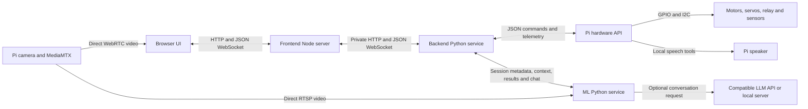

# Architecture and source map

[Documentation index](README.md) | [API maps](#communication-boundaries) | [Change or replace a component](DEVELOPMENT.md)

## System responsibilities

Robo has three computer services and a Pi hardware service. **Backend is the single software authority for robot actions.** Frontend provides the user experience, ML supplies detections/conversation, and Pi performs validated hardware operations with its own timeouts. The current automatic policy is supervised stationary aiming/spraying; it is not autonomous navigation.



The browser, ML and other permitted viewers can open video independently. The frontend **server** does not decode video. The Pi's `/ws` sends JSON, not camera files. New sensor/noise processing belongs in Backend; model-specific image processing belongs in ML. Keep these paths separate when extending the project.

## Communication boundaries

Ports below are defaults, not service discovery. Computer ports can change when occupied; the root supervisor maps the chosen ports into its children.

| Boundary | Transport/address | Credentials | Complete contract |
|---|---|---|---|
| Browser → Frontend | HTTP and WS `/api/v1/ws`, loopback UI port | Same-origin local session cookie by default; optional standalone token login | [Frontend/Backend API](API_BACKEND_FRONTEND.md) |
| Frontend → Backend | HTTP/WS, normally `127.0.0.1:8100` | `ROBO_SERVICE_TOKEN`, kept server-side | [Frontend/Backend API](API_BACKEND_FRONTEND.md) |
| Backend → Pi | WS `PI_HOST:8000/ws`; HTTP identity/status | No Pi token in API 2.3; one active controller socket | [Pi API](API_PI.md) |
| Backend → ML | HTTP `127.0.0.1:8200`, WS `/v1/inference` | `ML_SERVICE_TOKEN` | [ML API](API_ML.md) |
| Browser → MediaMTX | HTTP WHEP `PI_HOST:8889/cam/whep`, WebRTC media | Current Pi video configuration permits direct viewers | [Frontend](../Frontend/README.md), [Pi](../PI/README.md) |
| ML → MediaMTX | RTSP `PI_HOST:8554/cam`, TCP decode by default | Configured source | [ML](../ML/README.md) |
| ML → chat provider | Compatible chat-completions HTTP endpoint | Optional provider key; never given to browser or Pi | [ML](../ML/README.md) |

WHEP is the HTTP signaling exchange; the video itself uses WebRTC media transport, normally Pi UDP 8189. JSON/API access alone is not evidence of video reachability. The standalone Pi player is `/cam` on port 8889.

The normal UI is local to the computer. Opening the UI from another device requires the advanced bind/origin/login setup; making a UI public does not make a private Pi stream reachable. There is no configured public hosting, certificate provisioning or TURN service. Pi control is unauthenticated on its listening network, so network exposure is part of any replacement/deployment design.

## Processes, tasks and threads

| Location | Lifetime and execution |
|---|---|
| Computer launcher | `START_ROBO.cmd` calls PowerShell; it prepares tools, runs `bootstrap.py` to completion, then supervises `run_stack.py`. `run_stack.py` remains as a Python parent process. |
| Frontend | One Node process for HTTP, login/session management and WebSocket proxying. Browser JavaScript runs in each viewer's browser. |
| Backend | One Python/Uvicorn process. Async Pi connection, ML metadata connection, 50 ms control timer, per-client WebSocket send/receive tasks and bounded request work. No separate auto process. |
| ML | One Python/Uvicorn process. An active vision session adds two explicitly managed Python threads: capture and inference. Capture replaces a latest-frame slot; inference replaces a latest-result slot. Native libraries can use additional internal threads. |
| Pi API | One Python/Uvicorn process. Async telemetry and 25 ms watchdog tasks; a speech task starts owned `espeak-ng`/`aplay` subprocesses when requested. |
| Pi launcher | Bash supervises the API, MediaMTX and discovery advertisement. MediaMTX manages the configured camera capture/encoding resources; actual OS process count can vary with the camera implementation. |
| Discovery | The computer uses temporary mDNS activity and a bounded pool of HTTP probes; it is not another persistent robot-control service. |
| Simulation | An explicit extra fake-Pi Python process on the computer. Synthetic video is a separate optional publisher. |
| Optional local LLM | An external process you install separately. None is needed for keyless basic chat. |

Python worker threads are not force-killed on model replacement. ML cancellation/generation checks prevent stale results entering a new session; failure to retire a worker is a visible failure, not permission to start competing readers. See [ML internals](../ML/README.md).

Windows server descendants are born inside the launcher's Job Object. The OS cleans them up on launcher termination, including crashes. Normal shutdown also explicitly stops children. Pi supervision separately owns and cleans its processes. Do not replace these launchers with untracked background processes and assume the same cleanup behavior.

## Startup and reconnect

1. PowerShell verifies runtime ZIPs/executables, chooses installed or private Node, creates managed Python and obtains an installer lock.
2. `bootstrap.py` installs/checks dependencies and the pinned fire artifact, then prepares service settings. It records a successful dependency signature after checks pass.
3. The installer releases its lock. `run_stack.py` takes a separate OS instance lock; a second launch reuses the existing UI.
4. The supervisor chooses ports, probes the configured Pi identity and uses mDNS/known-host fallbacks if needed. It never selects arbitrarily among several discovered robots.
5. ML, Backend and Frontend start; the browser opens when the UI listener is ready. Robot actions begin stopped.
6. Backend reconnects its Pi and ML clients independently. The supervisor retries discovery about every 15 seconds. A changed Pi address restarts Backend/ML with new control/video URLs while preserving the frontend process.

Reconnection invalidates control assumptions. The browser operator must reclaim/resume when required; auto alignment confirmation resets after relevant loss. Neither a restarted server nor a recovered camera automatically authorizes motion.

## Data and decision flow

### A manual command

The browser sends a request ID, session identity and sequence with the requested action. Frontend validates the browser boundary and forwards it privately. Backend validates ownership, replay ordering, mode, limits and readiness, then maps the action into the smaller Pi command format. Pi validates the command and drives its module.

The backend result may mean **sent to Pi**, not physically executed. Pi has no generic actuator acknowledgement and no request deduplication. Pi telemetry provides subsequent reported output state. Retrying a relative servo command directly at Pi can move it twice; a replacement must retain the backend's duplicate-request protections.

### Sensors and readiness

Pi samples raw IR/flame channels and reports diagnostics plus per-component availability. Backend preserves unknown values, observes IR transition evidence and applies conservative clear/blocked processing. UI and chat receive processed state. Motion checks depend on relevant sensors and components, not a single global "hardware attached" flag.

Missing servo/pump outputs can be `null`. Never coerce them to 90/off or use a default as evidence that a stop succeeded. GPIO/controller availability, actuator power and actual physical movement are different observations.

### Detection and auto

ML decodes Pi video directly, loads the selected registry artifact and emits normalized fire/smoke boxes with stream/model/session/frame identity and local timing. Backend validates results, filters stale or mismatched messages, and passes accepted detections to `AutoPolicy` only when its operating gates allow it. The controller translates policy proposals into bounded Pi actions.

Auto still needs a live UI owner heartbeat. It scans, confirms, aligns, sprays briefly and reassesses while stationary. Smoke alone does not trigger spray. There is no measured range, path planner or impact verification. Policy completion returns control to an operator review step.

### Chat and voice

Backend supplies bounded processed robot/detection context to ML. Exact gesture parsing runs before conversational generation. Without a key, local code answers supported questions; a configured provider can supply broader text. Gesture proposals return to Backend for the same permission/readiness checks as UI commands. LLM prose never becomes executable robot commands.

Speech text goes Backend → Pi → local audio tools. It is not played by browser speech synthesis and does not need a cloud voice model. Acceptance, completion and audible playback are distinct.

## Source tree and module ownership

```text
MKBA-V.1/
  START_ROBO.cmd                   Windows entry point
  bootstrap.py                    Dependency and model preparation
  startup.py                      Settings repair, ports, discovery, instance lock
  configure.py                    Advanced configuration-file utility
  run_stack.py                    Computer service supervisor
  windows_processes.py            Windows parent/child lifetime binding
  scripts/
    bootstrap_windows.ps1         Verified runtimes and first-start installer
    package_pi.py                 Source-only Pi deployment archive
  Backend/                        Control authority, sensor processing, auto policy
  Frontend/                       Node proxy/session server and browser UI
  ML/                             Vision registry/adapters/engine and chat
  PI/                             Hardware API, components, GPIO drivers, speech
  tests/                          Configuration, process and full-stack checks
  Documents/                      Canonical cross-component documentation
  .runtime/ .venv/ logs/ dist/     Generated local files, excluded from Git
```

Every active service module has a responsibility map in its own README:

- [Backend modules](../Backend/README.md): `app`, `controller`, `auto_policy`, `sensors`, `robot_profile`, `pi_client`, `ml_client`, `config`, entry points and tests.
- [Frontend modules](../Frontend/README.md): `server.mjs`, `public/app.js`, `control.js`, `video.js`, HTML/CSS and tests.
- [ML modules](../ML/README.md): `app`, `schemas`, `config`, registry/adapter/capture/engine, downloader/checker, chat provider/local/actions/service and tests.
- [Pi modules](../PI/README.md): `server`, API dispatch, components, config, four hardware drivers, audio, simulation, launch/setup scripts, MediaMTX config and tests.

### Root modules in detail

| Module | Inputs, responsibilities and extension point |
|---|---|
| `START_ROBO.cmd` | Resolves its own directory, forwards command switches to PowerShell, keeps failures visible. |
| `scripts/bootstrap_windows.ps1` | Pins runtime download URLs/digests, validates cached executables against the ZIP entry, uses atomic extraction, prepares a managed venv, passes the selected Node path. Change here for a new installer platform/runtime. |
| `bootstrap.py` | Computes dependency recipe signature, installs CPU Torch/server packages, verifies imports/model, runs `prepare_settings`. Change installer dependencies here and in requirements; do not bypass artifact checks. |
| `configure.py` | Reads/writes simple `.env` values and validates matching tokens. Explicit `--pi-host` updates addresses; standalone conflicting credentials fail. Some printed manual-setup hints predate automatic startup; normal users use the launcher. |
| `startup.py` | Normal-start repair of generated settings, loopback enforcement, free ports, identity-checked discovery and URL mapping. Its `prepare_settings` is deliberately more opinionated than standalone `configure`. |
| `run_stack.py` | Merges/filters environments, creates children and logs, discovers/reconnects Pi, records stack URL, handles child failure and cleanup. Cloud credentials only enter ML's child environment. |
| `windows_processes.py` | Creates a non-inherited kill-on-close Job handle and places the launcher in it before children exist; no manual early close of this handle. |
| `scripts/package_pi.py` | Builds `dist/pi-ready.tar.gz` from allowed Pi source types, root README and canonical Documents; excludes settings, installed binaries/environments/caches and symlinks. |
| `requirements.txt` | Aggregate computer dependency entry; component requirements remain owned by their services. |
| `.gitattributes` | Keeps Pi `.sh` files with LF line endings after Windows checkout. |

### Legacy code

`Backend/auto_mode.py`, `gemini_detector.py`, `test_gemini.py`, `requirements-legacy.txt` and `Backend/web/` belong to the old combined application. They are not started by the current launcher and are not compatible replacements merely because their names sound similar. Keep changes on active paths or explicitly migrate them against the current contracts. The old Pi hardware-sweep entry point is retired; use documented tests/bench procedures.

## State and persistence

There is no database or durable mission log. Settings, artifacts, installation markers and text service logs are files. Operator ownership, stop/auto phase, inference sessions, request deduplication windows, browser sessions and chat context/history are bounded process/browser memory. Restart invalidates them. A replacement adding persistence must not restore old movement commands as live work.

Detection box timing uses local decoder receipt, not camera exposure time. Cross-machine monotonic clocks are not comparable. Preserve explicit age/session fields and null timing fields rather than claiming synchronized frames. See [API_ML](API_ML.md) before implementing tracking, overlays or sensor/video fusion.
