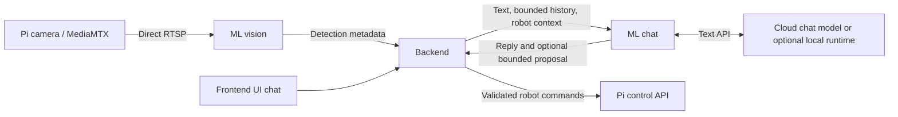

# ML implementation and audit guide

Updated 2026-09-09. This document details the `ML/` service. Backend, frontend, Pi deadlines and speaker integration are now implemented; see the [system implementation](SYSTEM_IMPLEMENTATION.md) and [current verification](SYSTEM_VERIFICATION.md). The [system architecture v2](SYSTEM_ARCHITECTURE_PLAN_V2.md) is design history.

## 1. How many models?

**Two model roles, not three fire detectors:**

| Role | Initial choice | Where it runs |
|---|---|---|
| Fire/smoke perception | One pretrained YOLOv8n checkpoint; fire and smoke are classes in the same model. | Computer, inside ML's inference worker. |
| Conversation | Basic local chat needs no model/key. Optional OpenAI-compatible API defaults to `gpt-4.1-mini`; add only `CHAT_API_KEY` for it. | Local ordinary code by default; optional API provider. An offline model can replace the provider later. |

The earlier three fire-model candidates were alternatives. They were never intended to run together. With no API key, only the one vision model is used. Basic conversation and the small movement parser are ordinary code, not extra ML models. Text chat does not need speech recognition. Pi speaker output uses local espeak-ng and aplay; it does not require another downloaded neural model.

### Why not automatically choose YOLOv13?

[YOLOv13 exists](https://github.com/iMoonLab/yolov13). Its authors release general object-detection weights and describe COCO evaluation; the [paper](https://arxiv.org/abs/2506.17733) reports gains on that benchmark. That does not establish performance for this robot's fire/smoke task. The repository also has its own implementation/runtime requirements, so a v13 checkpoint is not automatically interchangeable with a standard Ultralytics install.

Because training is outside this delivery, the immediate choice needs **already-trained fire/smoke weights**, compatible loading, and acceptable speed on this computer. I did not establish a verified ready-to-use YOLOv13 fire/smoke checkpoint in this search. A suitable v13 candidate can be tested and added later; the version number alone is not the selection criterion.

The initial artifact is [rabahdev/fire-smoke-yolov8n](https://huggingface.co/rabahdev/fire-smoke-yolov8n). The publisher describes D-Fire fine-tuning and classes smoke/fire. The installer pins revision `13017fe8af477c25f5298d168e2dfede4b000753`; `best.pt` is 6,229,802 bytes and has publisher-listed SHA256 `b91633799ceb052c814b4f8b77a37efc9a40f002d528df97d74463585fa4f28f`. Publisher license label: AGPL-3.0. The downloader verifies artifact identity; it does not establish accuracy or licensing rights for every deployment.

## 2. Boundaries and status



**Implemented:** direct RTSP reader, one-model vision engine, local artifact registry/checksum verification, normalized detection outputs, backend-facing API, useful keyless local chat, optional conversational provider adapter, robot-context prompt, deterministic gesture proposals, request limits/authentication, diagnostics, downloader/check command and regression tests.

**Now integrated:** backend/frontend clients, stationary autonomous aiming/spray policy, bounded gesture execution, Pi command timeouts, local speaker/TTS and approximate video overlays. Microphone input, tracking, exact synchronized overlays, navigation and distance fusion remain future work. The preserved `Backend/auto_mode.py` uses the older design; run `python -m Backend` for this implementation.

## 3. Module map: where to look when something fails

Paths are relative to the repository root.

| File/module | What it owns | Input → output | Typical fault |
|---|---|---|---|
| `ML/__main__.py` | Startup, .env loading, single Uvicorn worker | Environment → service on port 8200 | Wrong Python environment/port/dependency. |
| `ML/config.py` | Server, camera, model, chat settings | Environment → validated Settings | Incorrect URL, missing configuration. |
| `ML/schemas.py` | Strict API input formats | JSON → typed request | 422 or WebSocket invalid-command error. |
| `ML/app.py` | HTTP/WS routing, backend auth, connection ownership, request replay control | Backend requests ↔ vision/chat modules | Unauthorized request, duplicate request, stale session. |
| `ML/vision/registry.py` | Model IDs, versions, local file paths, hashes, label mappings | Registry JSON → model specification | Missing file, wrong hash or model ID. |
| `ML/vision/adapter.py` | Load/warm/predict using Ultralytics; normalize boxes | Decoded frame → detections | Runtime incompatibility, wrong classes, invalid model output. |
| `ML/vision/capture.py` | Direct RTSP/OpenCV/FFmpeg camera reader | Configured stream → decoded frames | Pi stream address/network/codec problem. |
| `ML/vision/engine.py` | Two workers, latest-frame/result slots, session validity and health | Frames + model → lifecycle/detection events | Stalled camera/inference, stopped worker still alive. |
| `ML/chat/provider.py` | Text-only compatible HTTP API | Conversation messages → text | Authentication, timeout, unsupported model/parameter. |
| `ML/chat/service.py` | Robot personality, limited context/history, gesture vs conversation routing | Backend chat request → reply/proposal | Unknown state, unsupported phrasing, provider unavailable. |
| `ML/chat/actions.py` | Explicit gesture recognition and fixed bounds | One supported phrase + context → proposal or rejection | Auto mode, stale state, missing controller/executor. |
| `ML/chat/local_basic.py` | Keyless greetings, status/detection summaries, help and simple personality | Text + validated current context → display text only | Limited English phrases; missing/stale status explicitly reported. |
| `ML/download_model.py` | Explicit pinned artifact installation | Published fixed URL/hash → local checkpoint and registry | Network/checksum/registry conflict. |
| `ML/check_model.py` | Local model smoke check | Blank frame or local image → JSON detections/timing | Model dependency/loading failure. |
| `ML/models/registry.json` | Registered model metadata | Model ID → artifact/adapter/revision | Edited config requires service restart. |
| `ML/tests/` | Offline regression coverage | Fakes/fixtures → pass/fail | Use the named failing test/module when reporting a bug. |

Setup commands are in [ML/README.md](../ML/README.md). Tests and weights are not copied to the Pi to make its server run.

## 4. Vision behavior and API

The backend connects to `ws://127.0.0.1:8200/v1/inference` with `Authorization: Bearer <ML_SERVICE_TOKEN>`. Only one backend connection is accepted. The browser continues using Pi video directly; it must not connect to this ML API.

The camera URL is configured on the server, not supplied by arbitrary requests. Send:

```json
{"type":"session.start","session_id":"auto-001","model_id":"fire-smoke-v8n"}
```

ML starts camera/model workers. It sends `session.starting`, model/stream lifecycle information, then `session.ready` only after a real decoded frame successfully passes prediction. Errors are distinct from healthy empty detections.

| Backend → ML | Meaning |
|---|---|
| `session.start` with session_id/model_id | Start one camera/model session. |
| `session.stop` with session_id | Invalidate results immediately; request worker exit. |
| `model.select` with model_id | Check that a model is registered while stopped. Loading/warming occurs on the next session.start. |
| `heartbeat` | Keep metadata connection active; returns heartbeat_ack. |
| `context.update` with session_id/context_revision | Returns context.ignored: this first RGB detector does not consume sensor context. Sensor fields are deliberately unsupported until an adapter requires them. |

Unlike the broader v2 proposal, this implementation does not prewarm a selected model without a camera session. It unloads on session stop. A full future context/fusion schema also remains unimplemented.

| ML → backend | Meaning |
|---|---|
| `hello` | Schema/capability information. |
| `session.starting`, `model.status`, `stream.status` | Startup progress; not all mean ready. |
| `session.ready` | Model/frame prediction succeeded. |
| `result` | Current-session detections plus frame/model/timing identity. |
| `health` | Worker state, errors, frame/result ages and counts. |
| `session.stopped` | Results invalidated; inspect worker state to learn whether native workers exited. More than one terminal notice may be observed; process it idempotently. |
| `error`, `context.ignored`, `heartbeat_ack` | Failure, unused-context response, or liveness. |

Example result (values illustrative):

```json
{
  "type": "result", "schema_version": 1,
  "session_id": "auto-001", "stream_id": "pi-cam", "stream_revision": 1,
  "capture_epoch": "reader-identifier", "frame_seq": 1042,
  "source_pts_ms": null, "source_clock_id": null,
  "frame_age_at_send_ms": 85, "frame_age_basis": "local_decoder_receipt",
  "model_id": "fire-smoke-v8n", "model_revision": "pinned-revision",
  "context_revision": null, "inference_ms": 78,
  "image": {"width": 1280, "height": 720},
  "detections": [{"class": "fire", "score": 0.91,
                  "bbox": [0.35, 0.30, 0.55, 0.70], "track_id": null}]
}
```

Boxes are normalized `[xmin,ymin,xmax,ymax]` in the original source image. `track_id` is null because tracking is not implemented. `frame_seq` belongs to this decoder, not the browser's separate video reader. Age measures time since local decoding, **not camera exposure**. The current browser overlay is therefore approximate and expires stale results.

The latest-frame slot holds one waiting frame. When inference is slower than capture, older waiting frames are replaced. The output similarly retains the latest unsent result rather than building a video backlog. Native decoder buffering still needs measuring on the real Pi stream.

Fresh IDs are required on each start; reuse within a connection is rejected. Reconnect after 256 sessions. A session error requires an explicit stop before starting again. Heartbeat every second; 10 seconds without a message closes the backend connection and invalidates inference. This is an **ML session timeout**, not a hardware stop mechanism.

## 5. Chat behavior and API

Backend calls `POST http://127.0.0.1:8200/v1/chat` with the same service Authorization header. Browser requests go through the frontend proxy and backend. API key/base URL/model are server configuration and cannot be overridden by chat text.

```json
{
  "request_id": "chat-001", "session_id": "operator-001",
  "message": "How are you doing?",
  "history": [],
  "context": {
    "mode": "manual", "pi_connected": true, "stopped": true,
    "state_age_ms": 80, "control_session_id": "operator-001",
    "operator_has_control": true, "movement_executor_ready": false,
    "latest_detection": null
  }
}
```

`stopped` is the backend's stop latch/inhibited state, not merely zero wheel speed. It is true by default. The backend owns this latch and supplies it in chat context. `speaker_available` is an optional boolean, default false, derived from backend speech configuration and Pi availability.

The model gets a brief personality instruction plus mode/connectivity/stop state, speaker availability and optional recent detection information. It receives no raw camera frames, Pi credentials, session IDs or complete sensor dumps. It can converse in the robot's voice while being honest about its capabilities. It is not the auto-mode manager and cannot claim a reply was physically heard.

**Without an API key**, `local_basic.py` answers greetings, status, help, detection and speaker questions, thanks, identity and a simple robot joke. It uses no network client and no extra model/process. This mode is explicitly labelled basic local chat. Robot state older than 1 second and detection data older than 750 ms are not described as current. Chat history cannot create an observation or action. Unsupported conversation receives a helpful explanation and example phrases.

The default compatible endpoint and model are preconfigured; adding only `CHAT_API_KEY` enables the optional `gpt-4.1-mini` conversation model ([official model documentation](https://developers.openai.com/api/docs/models/gpt-4.1-mini)). This is a short-response non-reasoning model choice, not a claim that it is the newest model. Configuration remains replaceable. Blank legacy model fields resolve to the default only at the official default endpoint. A provider failure falls back to local text and retains its redacted error code; the robot services continue running.

Every response adds `chat_mode`: `local_basic`, `llm`, or `bounded_command`. Health distinguishes `chat.available` (the chat capability is always available), `chat.configured` (a model provider has sufficient configuration), and `chat.mode` (`local_basic` or `llm`). Configuration does not prove provider access. ML speech health reports `delivery: "backend_to_pi"` and `hardware_execution: false`; current playback availability is supplied by backend context, not guessed by ML.

Backend supplies at most 12 previous user/assistant messages, each up to 2,000 characters. There is no shared global conversation or disk memory in ML. Backend must keep histories separate per user/session and store any history it wants to retain. Generated text is untrusted display text; never parse embedded JSON or code from it as an action.

Provider calls use a total timeout (20 seconds by default), response-size limit and 384-token output budget. At most four ordinary chat requests can be pending. There are no automatic retries or model tool calls. Known explicit gestures bypass the provider and its congestion; they still produce only backend proposals.

### Supported small gestures

| User phrase | Fixed proposal |
|---|---|
| `look left`, `look right`, `look up`, `look down` | One 5-degree face/servo change in the named direction. |
| `move forward`, `move backward`, `move a little forward` | One 300 ms movement at speed 0.2. This specifies time, not a calibrated physical distance. |
| `turn left`, `turn right` | One 300 ms turn at speed 0.2. |
| `stop` | Backend stop request. |

Optional polite wording such as `please look right` and `can you look right?` is accepted. Negated, quoted, multi-step and embedded commands do not match. `move left` is ambiguous; use `turn left` or `look left`. Pump activation, shutdown, mode changes, arbitrary angles/speeds, scripts and loops are not chat commands. Gesture language is intentionally narrow English initially; conversation language depends on the provider.

For non-stop gestures the backend-provided context must say: connected, manual mode, not stop-latched, current operator owns the matching session, state at most 1 second old, and a ready movement executor. Defaults block movement. Stop can be proposed in auto mode or with stale sensor state, but still requires the connected authenticated control session and an available backend executor.

Example successful **proposal**, not execution:

```json
{
  "type": "chat.reply", "request_id": "chat-002", "session_id": "operator-001",
  "text": "A small gesture request is ready for the backend. I haven't moved yet.",
  "chat_mode": "bounded_command",
  "action_status": "proposed", "reason_code": null,
  "action": {
    "action_id": "unique-id", "request_id": "chat-002", "session_id": "operator-001",
    "status": "proposed", "valid_for_ms": 1000,
    "kind": "look", "direction": "right", "degrees": 5
  }
}
```

The integrated backend implements these execution checks:

1. Recheck current session/ownership/mode/stop state and relevant live obstacle sensors at dispatch; never trust an old chat snapshot.
2. Count the 1-second proposal budget from the original request using the backend's monotonic clock, including network round-trip and queue delay. Do not give a delayed response a fresh 1-second window.
3. Deduplicate action IDs and relative servo actions. ML suppresses duplicate proposals for cached request IDs for 60 seconds (up to 256 entries); this is not durable backend deduplication.
4. Map semantic forward/left/right and servo face directions to **verified wiring/calibration**. The old backend has swapped motor signs; ML deliberately does not guess them.
5. Execute a bounded move with a guaranteed stop deadline and Pi-local command expiry. Do not enable this capability until backend/Pi failure stopping is implemented and checked.
6. Give stop/manual takeover priority; invalidate pending gestures when control/mode changes. Reject motion during auto; permit the authorized stop path.
7. Report proposed/accepted/rejected/sent/finished distinctly. Pi currently has no execution acknowledgments, so do not claim physical completion from a successful WebSocket send.

ML sets no executor capability itself. The backend derives it from current Pi connection, watchdog and telemetry state; actual execution also checks ownership, calibration and obstacles. ML proposals cannot bypass those checks.

## 6. Swapping models and speech

Vision: add a local artifact, exact revision/hash, adapter name and class mapping to `models/registry.json`; restart ML to reload the registry; stop the old session and start a fresh session with the new model ID. The current adapter supports native Ultralytics `.pt` detection checkpoints. Other runtimes (including an incompatible YOLOv13 fork) need a separate adapter/factory; no claim of universal drop-in loading.

Keep the original trainable checkpoint/config/source alongside any later ONNX/TensorRT export. Future fine-tuning is an offline job that produces a new registered version. No dataset preparation or training runs were added now.

Chat: change configured provider/base URL/model while keeping the backend contract. [Qwen3-4B-Instruct-2507](https://huggingface.co/Qwen/Qwen3-4B-Instruct-2507) is one offline candidate. A local server such as [Ollama](https://docs.ollama.com/api/openai-compatibility) can expose the same chat format. Actual speed/memory and response quality need checking on this computer; no offline chat model is installed.

Speech is implemented in `PI/audio.py`: the backend sends approved reply text to authenticated `POST /speech`, and espeak-ng/aplay synthesize and play it locally. Requests are bounded and deduplicated; Stop, cancellation and shutdown terminate owned playback processes. Enable `ROBO_SPEECH_ENABLED` only after checking the Pi audio device. Text chat works independently of speech.

## 7. Process/thread count

**This change adds one ML application process.** Inside it:

- One main asyncio event loop for HTTP/WS, provider HTTP, auth, heartbeat and metadata.
- Two explicit application threads only while vision runs: camera capture and model loading/inference.
- One active vision model and one configured chat provider; chat calls do not create another robot application process.

OpenCV, PyTorch and networking libraries may create native helper threads. The count above is for workers owned by this code, not the total OS thread count. No inference worker per viewer and no training service. Offline chat later adds a separate runtime service, which may itself create model runner processes.

## 8. Fault guide

Start with `/health`, then `/models`, then the specific error code. A running HTTP server is not proof that every dependency is ready.

| Symptom/code | Check first |
|---|---|
| 503 on protected endpoints | `ML_SERVICE_TOKEN` is empty; configure and restart. |
| 401 / WS 1008 | Backend Authorization header; no browser Origin; only one inference connection. |
| 422 / invalid_or_unavailable_command | Input schema, model ID, active session, and whether old workers have exited. |
| `camera_unavailable` | Pi MediaMTX running, RTSP URL/port8554, network, OpenCV FFmpeg support. |
| `camera_stale` | Stream stopped producing frames. Browser WebRTC may still work independently. |
| `model_load_failed` | Installed vision packages, registry artifact path/hash, actual fire class, runtime compatibility. Use check_model. |
| `inference_failed` | Invalid output or inference freshness budget exceeded; check selected model/device. |
| Worker unhealthy/still stopping | Native call did not finish; stop results, inspect health, restart ML if it cannot exit. |
| Empty detections | Valid processed frame with no accepted detections. It is not a guarantee there is no fire. |
| `chat_mode: local_basic` | Normal without an API key, or a provider fallback. Status/help/basic conversation and bounded gestures still work. |
| `provider_authentication` / `provider_rate_limited` | Provider credentials/access or quota; no raw provider body/key is returned. |
| `provider_http_error` | Provider model name/API compatibility, including token-limit field. |
| `provider_timeout` / `provider_connection_error` | Provider/runtime reachability; ordinary chat cannot interrupt detection workers. |
| `provider_incomplete_response` | Model did not finish within the response budget or returned a filtered response. |
| `provider_tools_not_allowed` | Provider returned a tool call; it was rejected, never executed. |
| `executor_unavailable` | Backend reports no fresh Pi/watchdog executor; check its connection and state. |
| `manual_mode_required`, `robot_stopped`, `robot_state_stale`, `control_required` | Backend context gates blocked the gesture; inspect actual robot state before enabling it. |
| `duplicate_request` / 409 | Request ID replay or reuse with changed content. Generate new IDs for new user requests, not retries. |

When reporting a fault, include module/error code, request/session ID, model ID, and whether camera/chat/backend was connected. Remove API keys and service tokens from logs.

## 9. Verification record

- **75 offline regression tests passed.** They cover API authorization/input limits/session cleanup/replay behavior, chat/provider failures, bounded gesture gates, direct-reader/session worker isolation, model labels/coordinates, and download integrity/failure cleanup. Twelve new tests cover keyless conversation without a network client, stale/missing robot and detection context, history isolation, unsupported gestures, speech availability, provider fallback, and key-only default configuration. Tests use doubles and mock provider responses; they do not actuate hardware or call a paid API.
- The pretrained artifact was downloaded and matched the publisher-listed size/SHA256. Original checkpoint and provenance are retained locally under the ignored weights directory.
- Actual CPU checkpoint/runtime check **passed** on development Windows Python 3.12 with torch 2.14.0+cpu, torchvision 0.29.0+cpu, ultralytics 8.4.144 and OpenCV 4.14.0.94. A 640x480 synthetic blank frame loaded, warmed and produced a valid empty detection list. A single warmed call measured about 31 ms; this is not an accuracy evaluation or a sustained camera-throughput benchmark. See [tested packages](../ML/requirements-vision-tested.txt). `pip check` passed. Packages were installed in the developer-only `.verification` environment, not system Python.
- Live cloud chat was not tested: no API key was supplied. The default model is configured, and keyless local chat was tested. Mock HTTP tests do not establish account access or conversational quality.
- The later full-stack check exercised direct synthetic RTSP with the real checkpoint and metadata through the backend. The actual Pi camera, physical motion, nozzle/servo calibration, fire-detection accuracy and audible speaker output remain untested.
- Backend/frontend/Pi integration is now implemented. See [current system verification](SYSTEM_VERIFICATION.md) for complete test results and remaining physical checks.
