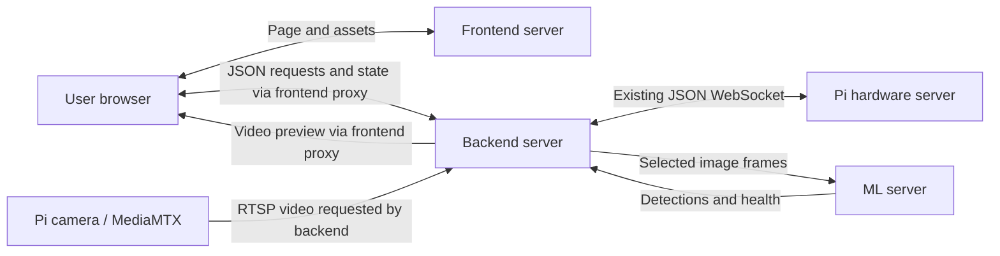

# Robot architecture and API plan — draft for audit

> **Historical v1 proposal.** It was superseded by [v2](SYSTEM_ARCHITECTURE_PLAN_V2.md). The implementation is now recorded in [SYSTEM_IMPLEMENTATION.md](SYSTEM_IMPLEMENTATION.md), with [verification results](SYSTEM_VERIFICATION.md). Status statements below describe this plan when written.

Status: **proposal only; not approved or implemented**. Created 2026-09-08. This document defines the next phase; the existing combined laptop program does not yet implement these interfaces. No application code was changed to create this plan.

## 1. Overall design

There are **three computer-side services plus the existing Pi server**:

| Component | Owns | Does not own |
|---|---|---|
| Frontend server and browser UI | Serves the user interface; displays video, state, detections and errors; sends user requests. | Hardware connections or final authority over commands. |
| Backend server | All Pi connections, input validation, manual/auto ownership, automation state machine, limits, timers, command ordering and authoritative application state. | Training or running the detection model inside its control event loop. |
| ML server | Loads a model, processes images, returns detections, tracks and inference health. | Direct motor/pump commands or a connection to the Pi. |
| Pi server and MediaMTX | Executes the existing five command types, reads sensors, publishes status and camera video. | High-level autonomous decisions. |

**Every request to the Pi goes through the backend.** The strict default here includes video: only the backend opens the Pi RTSP stream. The frontend and ML server never contact the Pi directly.



The frontend proxy is only transport. It does not decide whether a command is allowed. Browser requests use a single frontend origin; the proxy forwards API, WebSocket and preview traffic to the backend.

### Proposed deployment

Initially run all three new services on the local computer as separate processes. They can later move to separate machines without changing their roles.

| Service | Proposed address | Listener |
|---|---|---|
| Frontend | `http://localhost:3000` | Browser-facing |
| Backend | `http://127.0.0.1:8100` | Local frontend proxy |
| ML | `http://127.0.0.1:8200` | Backend only |
| Pi API | `ws://PI_IP:8000/ws` | Existing Pi service |
| Pi camera | `rtsp://PI_IP:8554/cam` | Backend reads using RTSP over TCP |

Ports are proposals. Do not expose ML or backend on the LAN unless another machine actually needs them; add authenticated service connections if they move off the same host. The browser must obtain an authenticated backend session through the frontend; one operator holds the control lease, while other permitted users can observe or stop.

## 2. API inventory: frontend and backend

### HTTP routes

These are proposed backend routes, reachable through the frontend proxy with the same paths.

| Method and path | Request | Response / purpose |
|---|---|---|
| `GET /api/v1/health` | None | Backend live/ready plus Pi, camera and ML connection states. Backend can be live while auto is unavailable. |
| `GET /api/v1/robot` | None | Full current state snapshot, including stale/unavailable flags. |
| `GET /api/v1/auto/config` | None | Auto profile, model ID, limits and current configuration revision. |
| `PUT /api/v1/auto/config` | Validated configuration | Accepted configuration/revision or field errors. Only while stopped; this does not start auto or train a model. |
| `GET /api/v1/ml/models` | None | Available model IDs/capabilities relayed from ML. |
| `GET /api/v1/video/preview` | None | Backend-generated multipart JPEG preview for the first version. |
| `WS /api/v1/ws` | Connect/session | Bidirectional control, status and events below. |

The frontend server itself only needs page/static routes and the proxy. Training and uploading arbitrary models are not exposed through the user UI in the first version. Authentication mechanism (local pairing token vs user login) is an audit decision.

### Browser to backend WebSocket messages

Preserve familiar Pi command names at the UI boundary, with backend-only tracking fields. `request_id` identifies a request; `session_id` is issued by the backend; `seq` increases within that session. The backend determines the sender identity itself.

| Type | Body fields | Backend behavior | Pi mapping |
|---|---|---|---|
| `drive` | `left`, `right`, `speed`, `ttl_ms` | Accept only from manual controller; normalize directions, enforce limits and command expiry. | `drive` |
| `servo` | `pan`, `tilt` | Relative degree increments; clamp permitted increments, reject duplicates/expired requests. | `servo` |
| `pump` | `on`, optional `duration_ms` | Strict booleans. Starting pump requires bounded duration and permission; backend schedules OFF. | `pump` ON and later OFF |
| `mode` | `value: manual or auto` | Stop old actions, invalidate prior control session, check prerequisites and switch owner. | `mode`; also stop commands during transition |
| `auto` | `action: approve_burst`, auto session ID, target ID, `duration_ms` | Approve one bounded pump burst only in READY_TO_SPRAY, from the operator, for that still-current target. Expired/repeated approval is rejected. | Validated pump ON and timed OFF |
| `system` | `command: stop or shutdown` | STOP is highest priority; SHUTDOWN means the Pi script, not laptop OS or ML process. | Existing `system` |
| `control` | `action: claim, release or resume` | Manage ownership and clear backend stop latch explicitly when eligible. Never starts motion by itself. | None |
| `heartbeat` | Session and sequence | Renew the operator lease; does not command hardware and does not prove video/ML freshness. | None |

Example manual drive request:

```json
{
  "type": "drive",
  "request_id": "ui-42",
  "session_id": "manual-session-7",
  "seq": 42,
  "ttl_ms": 500,
  "left": 1,
  "right": -1,
  "speed": 0.3
}
```

The backend strips tracking fields and sends only the existing Pi message:

```json
{"type":"drive","left":1,"right":-1,"speed":0.3}
```

`ttl_ms` is initially enforced by the backend; the present Pi does not enforce it. Do not interpret it as protection against a backend crash.

### Backend to browser messages

| Type | Contents |
|---|---|
| `hello` | Protocol version, backend instance ID, capabilities, ownership information and initial state. |
| `state` | Authoritative backend mode/auto state, commanded outputs, last Pi report, data ages, stop latch, pump timer and connection health. |
| `command_result` | `request_id`, outcome (`rejected`, `accepted`, `sent_to_pi`), reason and backend timestamp. |
| `detections` | Frame ID, model version, boxes/classes/scores, selected target and result age for UI overlays. |
| `event` | Mode transitions, control lease changes, target acquisition/loss, pump burst ending and shutdown connection closure. |
| `error` | Backend/ML/Pi source, code, readable message, and `request_id` only when association is actually known. |
| `heartbeat_ack` | Confirms operator heartbeat was received. |

**`sent_to_pi` is not proof of execution.** The current Pi has no command acknowledgments or IDs. Keep commanded state and reported state separate. A Pi error without a request ID must not be falsely assigned to a particular queued command.

For UI labels, distinguish `connected`, `stale`, `unavailable`, and `unknown`. Present Pi servo angles as commanded positions and pump state as software state, not measured movement/water flow. Keep Pi's stale speed field separate from the backend's last commanded speed.

## 3. API inventory: backend and ML

The backend initiates the connection. ML provides:

| Endpoint | Purpose |
|---|---|
| `GET /health` | Process alive, model ready/loading/error, model version, device and recent inference performance. |
| `GET /models` | Installed/allowed model IDs, classes and supported input sizes. |
| `WS /v1/inference` | Session management, frames, results and errors. |

### Backend to ML

| Message | Fields / meaning |
|---|---|
| `session.start` | `session_id`, `model_id`, input dimensions, requested classes and configuration revision. A model is loaded once and kept warm. |
| `frame` | Frame ID, session ID, context revision, age at dispatch, image size/format and JPEG bytes. |
| `session.stop` | Invalidates the session and tells ML to discard pending work; backend rejects its late results immediately without waiting for ML to respond. |
| `heartbeat` | Service liveness ping; independent of inference progress. |

Frame messages should be binary, not base64 embedded in repeated JSON. Proposed atomic framing: 4-byte unsigned big-endian JSON-header length, UTF-8 header, then JPEG bytes. One WebSocket message contains the complete frame. Enforce a maximum header/image size. This prevents a header becoming separated from its image.

Example decoded frame header:

```json
{
  "type": "frame",
  "session_id": "auto-session-8",
  "frame_id": 1042,
  "context_revision": 61,
  "age_at_dispatch_ms": 25,
  "width": 640,
  "height": 360,
  "encoding": "jpeg"
}
```

Backend retains the corresponding receive time, telemetry age, camera pose estimate and configuration revision. The ML detector does not need to interpret raw GPIO values.

### ML to backend

| Message | Fields / meaning |
|---|---|
| `session.ready` | Session/model ID, version, device and loaded classes. |
| `result` | Matching session/frame/context IDs, detections, inference time and model version. |
| `session.stopped` | Session cleanup acknowledged. |
| `health` | Model/video-processing readiness, queue drops, recent latency and errors. |
| `error` | Session/frame identifiers when available, error code and explanation. |
| `heartbeat_ack` | Service liveness response. |

Example result:

```json
{
  "type": "result",
  "session_id": "auto-session-8",
  "frame_id": 1042,
  "context_revision": 61,
  "model_version": "fire-detector-v1",
  "inference_ms": 78,
  "detections": [
    {
      "class": "fire",
      "score": 0.91,
      "bbox": [0.35, 0.30, 0.55, 0.70],
      "track_id": "target-3"
    }
  ]
}
```

`bbox` means `[xmin, ymin, xmax, ymax]` normalized to 0–1 in the original frame, after reversing any model resize/letterboxing. `score` is a model score, not a guaranteed probability. A healthy frame with no detections returns `detections: []`. Decode/inference failures return an error, never a misleading empty detection list. Track IDs are scoped to the session and may be null if tracking is disabled.

ML produces observations. The backend's control policy translates those observations into actions. If learned action planning is added later, ML may propose actions, but backend ownership, expiry and stop rules still apply.

## 4. API inventory: backend and Pi — preserve current protocol

This boundary already exists; all outer metadata remains in the backend.

| Backend to Pi | Existing JSON |
|---|---|
| Drive | `{"type":"drive","left":1,"right":-1,"speed":0.3}` |
| Relative servo movement | `{"type":"servo","pan":5,"tilt":-5}` |
| Pump | `{"type":"pump","on":false}` |
| Mode label | `{"type":"mode","value":"auto"}` |
| Stop and center | `{"type":"system","command":"stop"}` |
| Stop Pi server process | `{"type":"system","command":"shutdown"}` |

| Pi to backend | Existing contents |
|---|---|
| `hello` | Current Pi mode after connecting. |
| `status` | Mode, speed field, servo angles, pump state, flame/IR arrays; nominally 5 Hz. |
| `error` | Message text when an error escapes into the dispatcher. |

For a temporary hold during target verification, send drive zero and pump OFF while keeping the camera position. Reserve `system.stop` for operator stop/fault/mode reset because it also centers the servos. Keep one backend-owned Pi connection and a single serialized writer so manual and automatic sources cannot interleave commands.

On reconnect: invalidate previous requests/results, enter stopped state, send stop/OFF when possible, reconcile fresh status, and require explicit resume. Do not replay pre-disconnection motion or relative servo commands.

## 5. Camera distribution

The backend owns a single RTSP capture from Pi MediaMTX and decodes outside the control event loop. RTSP input through OpenCV is supported by [MediaMTX's Python reader documentation](https://mediamtx.org/docs/read/python-opencv).

- Feed only the newest selected frame to ML; retain at most one frame waiting behind the one in progress.
- Serve a downsampled browser preview from the backend through the frontend proxy. Proposed initial target: 640×360 at 10 FPS, adjusted after measuring the computer. This is a **new backend preview endpoint**, not restoration of the removed Pi MJPEG route.
- Browser overlays carry matching frame IDs. If the preview transport cannot expose exact IDs, show detection age and approximate alignment, or render overlays server-side on the associated frame. Do not imply perfect synchronization.
- If JPEG preview overhead is too high, upgrade the backend media relay to WebRTC later while preserving backend ownership of the Pi connection. No additional independently controlled application server is required for the first version.
- Record backend monotonic receive times and enforce bounded decoder buffers. Receiving a frame now does not prove it was captured now; quantify camera/transport buffering and use source timestamps when available. Do not compare monotonic clocks from different hosts.

## 6. Control ownership, stop and failure handling

The backend owns two separate fields: `mode` (`manual` or `auto`) and execution status (`stopped`, `running`, `fault`, or `shutting_down`). ML target state is a third field. This avoids treating the Pi's mode label as proof of autonomous operation.

Priority: **stop/shutdown and faults > ownership transitions > the one active manual or auto controller**.

| Situation | Proposed behavior |
|---|---|
| Manual mode | Lease-owning operator may drive, nudge servos and request bounded pump operation. ML may display observations but cannot influence outputs. |
| Enter auto | Stop manual outputs, change session ID, verify Pi/camera/sensors/model readiness, send Pi mode, start ML session, then run the approved auto profile. |
| Auto mode | Backend alone generates actions from fresh ML results and sensor rules. Normal manual drive/servo/pump-ON requests are rejected; stop, pump-OFF and mode change remain available. Operator pump authorization uses the explicit `auto.approve_burst` request above, not unrestricted pump ON. |
| Return to manual | Invalidate auto session first, cancel pump/motion timers, stop outputs, update Pi mode and issue a new manual control session. |
| Operator STOP | Latch stop in backend, invalidate queued actions/results, pump OFF, send system.stop. Explicit control.resume or approved mode transition is required to move again, with fresh session/readiness checks. Authenticated permitted stop requests bypass control-lease ownership. |
| Pi shutdown | Stop/invalidate first, send system.shutdown, then expect connection closure. UI/backend/ML processes stay available; closure means disconnected, not a proven graceful exit. |
| Browser closes/lease expires | Stop the robot and pause auto for the initial supervised version. Backend stays alive; do not kill it just because the UI disappeared. |
| ML timeout/crash | Pause auto and stop outputs; manual operation can remain available after explicit mode change if its prerequisites are healthy. |
| Stale camera/required sensors | Block auto actions, stop outputs, show the precise reason. A sensor value -1 means unknown, never clear. |
| Pi link lost | Show disconnected, reject new actuation, purge queues. Physical stop cannot be guaranteed by the laptop once the link has failed. |

### Starting timing proposals — must be measured

| Item | Initial proposal |
|---|---|
| Browser heartbeat | Every 1 s; operator lease expires after 3 s. |
| Manual drive updates | 10 Hz while held; immediate zero command on release/blur. |
| Drive command expiry at backend | 500 ms after backend receipt, including time spent queued. |
| ML inference target | 5–10 results/s, latest frame only. |
| Result freshness ceiling | 500 ms from backend frame receipt to decision, plus measured capture buffering. |
| Pi telemetry stale threshold | 1 s with its nominal 5 Hz status. |
| Servo output | At most one bounded relative adjustment per accepted fresh result, with mechanical rate/settling limits. |
| Pump | Bounded bursts with OFF deadline, cooldown and total attempt limit; actual durations require nozzle/pump testing. |

Drive messages are replaceable state: drop superseded requests. Servo deltas are increments: consume each request/result once, never repeat a cached delta on every control tick. Stop clears both queues. Use session IDs and request deduplication to prevent delayed messages from an old controller moving the robot.

**Pi follow-up needed before autonomous actuation:** the present Pi has no local command timeout. A laptop crash or stalled connection can leave the last motor/pump command active. Propose a small Pi server-level watchdog and bounded pump timeout, subject to separate approval, without changing hardware drivers or adding more command types. Backend heartbeats cannot substitute for this. Until verified on the Pi, limit auto development to observation and supervised tests rather than claiming autonomous fail-safe behavior.

## 7. Auto mode: proposed stages

The long-term objective is detecting a target, aligning, approaching when permitted, operating the pump, and reassessing. Build this in stages so each decision can be audited.

| State | Backend action | Transition |
|---|---|---|
| `OBSERVE` | Run inference and display boxes; no automatic actuator output. | Operator enables an approved actuation profile. |
| `SEARCH` | Hold chassis stopped; scan camera only within calibrated limits, with pump off. | Candidate target appears. |
| `CONFIRM` | Require repeated consistent detections over a time window; correlate available flame readings and check freshness. | Confirmed target or return to search. |
| `ALIGN` | Use target-center error to issue small relative servo adjustments; wait for movement to settle. | Target inside calibrated aiming region. |
| `APPROACH` — later | Bounded low-speed chassis movement with verified obstacle/edge rules and a defensible stopping-distance method. | Reach approved working region, or stop on uncertainty. |
| `READY_TO_SPRAY` | Motors stopped, target still stable, geometry calibrated; request operator authorization in the first actuation version. | Operator approves a bounded burst. |
| `SPRAY` | Backend turns pump on for the approved duration, then off unconditionally at its deadline. | Reassess. |
| `REASSESS` | Observe fresh frames with pump off; allow water/steam/occlusion to clear. | Another approved attempt, loss of target, or completion. |
| `PAUSED/FAULT` | Stop outputs, clear pending actions, display reason. | Explicit recovery after prerequisites pass. |

Recommended delivery order: observation → stationary target alignment → operator-approved pump bursts → supervised approach → fully automatic bursts only after acceptance criteria and mechanism are approved.

### Important physical limits

- We still need to confirm whether camera and nozzle move together. If only the camera moves, centering a box in its image does not aim a fixed nozzle.
- Calibrate camera/nozzle offset, servo direction, pulse/mechanical limits, motion settling and usable spray region. Camera image center is not automatically the water impact point.
- The current four IR and four flame inputs are digital signals. They do not establish target distance or a map. Bounding-box size alone is not reliable physical distance for fires of different sizes.
- A camera that pans away from the chassis center complicates drive steering. Use calibrated camera angle when interpreting target direction, or center the camera before chassis motion.
- Motors support only sign directions and one shared speed. Start with discrete move/stop/turn actions; unequal per-wheel power for smooth curves is not representable by this API. Verify actual wiring direction rather than assuming equal signs mean forward.
- No wheel encoders, odometry, depth sensor or pump flow feedback are declared in current code. Precise distance movement, autonomous navigation and confirmation of water delivery would require additional measurement/design.
- Removing visible fire from a frame does not prove extinguishment: target loss, occlusion and detection failure must remain separate outcomes.

## 8. What to build in the ML server

### Runtime pipeline

Receive latest frame → validate/decode → resize/normalize → run detector → map boxes back to original image → optional short-term tracking → return result and timing.

Start with a compact local object detector trained or validated for the intended fire scenes. The existing code references a fire model and Gemini; check actual available weights before selecting a model. A generic pretrained detector must not be assumed to include fire. Model choice and inference size depend on the computer's CPU/GPU/RAM, which are not yet confirmed.

Object detection supplies boxes, classes and scores; it does not itself define the driving policy. Ultralytics documents this output contract and custom training in its [detection guide](https://docs.ultralytics.com/tasks/detect). The final model family/version is an audit decision, not selected by this plan.

Keep model loading/inference in the ML service. Training happens offline as a separate workflow; do not retrain during robot operation. A cloud language/vision model can optionally explain events later, but the proposed time-sensitive control path runs locally and uses bounded, testable decisions.

### Dataset and training work

1. Define classes first: fire is the initial target; smoke, people or other classes are optional and need their own data and behavior rules.
2. Collect representative recorded scenes from the actual camera: distance, lighting, backgrounds, movement, partial occlusion and no-fire scenes. Include confusing negatives such as reflections, red/orange objects, lights and screens. Use existing/controlled data rather than creating uncontrolled fire scenarios.
3. Label bounding boxes consistently and document ambiguous cases.
4. Split by recording session/location, not random neighboring frames, so near-identical video frames do not leak between training and testing.
5. Fine-tune and compare a small model against a baseline. Keep a held-out test set separate from tuning.
6. Measure precision/recall, missed detections, false alarms per minute, target acquisition/loss behavior and latency under realistic video load. Standard detector validation is available in the [Ultralytics validation workflow](https://docs.ultralytics.com/modes/val).
7. Tune decision thresholds and temporal confirmation on validation data; do not choose pump activation from confidence alone.
8. Version weights, class map, preprocessing, training data revision, thresholds and evaluation results. Export/optimize only after benchmarking on the deployment computer; preserve a rollback model.

## 9. Implementation and acceptance plan

No implementation starts until the architecture/API decisions are reviewed.

| Phase | Deliverable | Acceptance evidence |
|---|---|---|
| 1. Contracts | Approve this map, schemas, ownership and stop semantics. | Example messages for success, rejection, stale data and reconnect agreed. |
| 2. Backend + simulated Pi | Single Pi adapter, validated UI API, sessions, timers, state and errors. | Duplicate servo requests ignored; old sessions rejected; manual/auto cannot both command; backend survives UI/ML disconnect. |
| 3. Frontend | Manual controls, stop available in every mode, heartbeat, video/state ages and error display. | Release/blur stops movement requests; observer cannot drive; stop takes priority. |
| 4. Camera + ML observation | Backend-owned RTSP capture, bounded frame queue and ML detections. | No direct UI/ML Pi connections; stale frames dropped; video failure differs from no detections. |
| 5. Pi integration gates | Bookworm hardware checks; proposed Pi watchdog separately approved and tested. | Backend kill/network loss stops actual actuators within measured limits; no automatic resume on reconnect. |
| 6. Stationary auto | Search/confirm/align; pump remains operator-approved. | Correct servo sign/geometry; limited steps; target loss stops action; bounded pump OFF verified. |
| 7. Approach/full auto | Only after distance, sensing and pump-policy decisions. | Tested stopping region, obstacle/edge response, repeat limits and false-positive behavior. |

During migration, the old `Backend/auto_mode.py` must not run as another Pi controller alongside the new backend. Its combined HTTP/UI, inference and control responsibilities are split into the three new services. Fixing its old video and heartbeat behavior is part of replacement, not a reason to preserve two competing command paths.

## 10. Audit decisions

Edit the last column or reply using the IDs. Blank means not approved yet.

| ID | Decision | Proposed default | Your choice / notes |
|---|---|---|---|
| A1 | Service location | All three on local computer initially; separate processes. | |
| A2 | Pi access | Backend only, including camera reads. | |
| A3 | Frontend video | Backend JPEG preview first; measure before choosing a more complex relay. | |
| A4 | ML role | Detections/tracks only; backend owns auto state machine. | |
| A5 | First auto capability | Observe, then stationary alignment and operator-approved pump. | |
| A6 | Approach | Deferred until distance/stopping method is agreed. | |
| A7 | Camera/nozzle mechanics | Need confirmation: shared pan/tilt or camera-only? | |
| A8 | ML computer | Need CPU, GPU and RAM before model choice. | |
| A9 | Stop behavior | Backend latch with explicit resume; no motion replay. | |
| A10 | Browser disappears | Stop/pause auto; backend remains running. | |
| A11 | Physical link-loss handling | Approve a Pi server watchdog before automatic actuation. | |
| A12 | Pump policy | Bounded bursts, cooldown, attempt limit; first version requires operator approval. | |
| A13 | Users/auth | One active operator, observers, authenticated stop; pairing vs login to decide. | |
| A14 | Scope of shutdown | Stop Pi server/stream only; leave laptop services running. | |
| A15 | Recording | Short diagnostic event log by default; image/video retention opt-in and bounded. | |

## Planning record

- Created architecture, API inventory, ML workflow, auto-state proposal and acceptance plan.
- Preserved the current five Pi command types; proposed future Pi watchdog is explicitly unimplemented and requires review.
- No application code changed. Existing source fixes and staged changes from earlier work are unrelated to this planning document.
