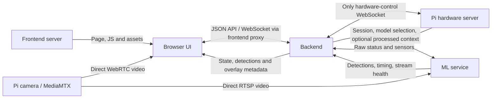

# Robot architecture plan v2 — direct video and pretrained models

> **Historical plan.** Backend, frontend, ML and Pi integration are now implemented. Use [SYSTEM_IMPLEMENTATION.md](SYSTEM_IMPLEMENTATION.md) for current behavior and [SYSTEM_VERIFICATION.md](SYSTEM_VERIFICATION.md) for results. This file preserves the broader proposal; the planning status below describes when it was written.

Updated 2026-09-09. **Planning only: no application code, new services, model downloads or training jobs were created.** This replaces the [v1 proposal](SYSTEM_ARCHITECTURE_PLAN.md) for further audit. Only the changes explicitly requested by the user are accepted requirements; the other design choices below remain proposals.

## 1. Changes from v1

| Topic | Revised decision |
|---|---|
| Video access | Frontend/browser and ML can each read video directly from Pi MediaMTX. Backend may also read it if a future feature needs it, but does not decode/relay it in v2. |
| Hardware commands | All commands to the Pi hardware API still go through the backend. |
| Sensor and robot data | Pi → backend → frontend/ML as needed. Backend owns normalization, noise handling, freshness and validity. |
| ML inputs | Direct camera stream plus optional processed context from backend. Backend no longer sends image frames to ML. |
| First model | Use downloaded, already-trained fire/smoke weights. No initial dataset creation, labeling or training phase. |
| Future ML | Swappable model adapters and versioned artifacts; retain original checkpoints for future fine-tuning where supported. |
| Future video overlays | Browser draws boxes, labels and aim/analysis markers over direct video from metadata, without requiring re-encoded video. |

**Protocol clarification:** Pi `ws://PI_IP:8000/ws` carries JSON commands/status, not video files. Browser video uses WebRTC with MediaMTX's WHEP HTTP signaling; ML can read RTSP. MediaMTX documents [browser playback](https://mediamtx.org/docs/read/web-browsers) and [Python/OpenCV RTSP input](https://mediamtx.org/docs/read/python-opencv).

## 2. Component and connection map



The frontend server serves the application. The **browser** decodes the direct video; the frontend server does not need to download and re-encode it. Its API proxy forwards JSON only. ML has its own independent video reader. Multiple viewers do not create additional ML models or control sessions.

| Component | Proposed internal parts |
|---|---|
| Frontend/browser | Video player; future overlay renderer; controls; state/health display; backend connection; operator heartbeat. |
| Backend | Pi connection; command validator and single writer; sensor processor; state store; manual/auto controller; ML metadata client; event publisher. |
| ML | Video reader; latest-frame slot; model registry; runtime adapter; inference worker; result normalizer; optional tracking/context consumer; health reporter. |
| Pi hardware server | Existing motor/servo/pump commands and sensor/status reporting. |
| Pi MediaMTX | Camera capture/encoding and distribution to independent readers. |

### Proposed addresses

| Purpose | Address | Who connects |
|---|---|---|
| Frontend | `http://localhost:3000` | User's browser |
| Backend | `http://127.0.0.1:8100` | Frontend JSON proxy |
| ML metadata API | `http://127.0.0.1:8200` | Backend |
| Pi commands/status | `ws://PI_IP:8000/ws` | Backend only |
| Pi WebRTC player | `http://PI_IP:8889/cam` | Browser can open directly |
| Pi WHEP endpoint | `http://PI_IP:8889/cam/whep` | Browser's embedded video player |
| Pi RTSP source | `rtsp://PI_IP:8554/cam` | ML, initially RTSP over TCP |

WHEP is signaling, not the media transport; default WebRTC media also needs UDP 8189 reachability. Initially assume a local LAN. A later HTTPS/public frontend requires appropriate HTTPS media signaling, CORS, certificates and ICE reachability; direct private-Pi access cannot be assumed from an arbitrary remote browser. Video-viewing permission does not confer command permission. Multiple direct viewers increase Pi/network bandwidth; measure capacity before adding many viewers, and add an optional media relay later only if necessary.

## 3. Data processing: what belongs in backend versus ML

**Backend processes non-video robot data. ML preprocesses images for its selected model.** The backend does not add a video hop or an image-denoising stage in this design.

| Input | Backend treatment | Is ML required to receive it? |
|---|---|---|
| Flame GPIO array | Preserve raw values; expose normalized detection, validity, age and optional temporal confirmation. | No for a normal RGB detector. Optional for later fusion or contextual tracking. |
| IR GPIO array | Verify polarity and meaning for this wiring; expose per-direction clear/blocked/unknown rather than pretending unknown is clear. | Usually no. Backend uses it to restrict movement. |
| Pan/tilt angles | Preserve reported commanded angles with age; do not label them measured pose. | Optional for a context-aware tracker; backend needs them for aiming/steering geometry. |
| Pump/mode/commanded motion | Record command history and latest Pi reports separately. | Optional to describe spray occlusion or camera/chassis movement. |
| Model results | Reject stale/session-mismatched results; use confidence/temporal policies for auto decisions. | Results originate in ML. |

Noise handling must not hide hazards. Suggested rule: promptly propagate a newly hazardous IR indication; require stable clear samples before clearing it. Keep flame confirmation configurable. At the Pi's current 5 Hz telemetry, filtering multiple samples introduces a real delay; measure and report that delay. Preserve raw samples and validity alongside filtered values. A value of -1 remains unknown; do not average binary sensors into false physical measurements.

Ordinary pretrained image detectors accept image tensors; adding an IR array to a request does not make those weights understand it. An adapter declares whether it accepts context. The backend sends only required context; basic detection still works without it. Sensor decisions remain active in the backend even if ML requests no sensor data.

## 4. API and message inventory

All interfaces below are proposed except the existing backend↔Pi wire format. JSON control/metadata stays separate from video.

### Frontend/browser ↔ backend

HTTP endpoints through the frontend proxy:

| Method/path | Purpose |
|---|---|
| `GET /api/v1/health` | Backend/Pi/ML readiness; ML stream health is reported independently of the browser player's health. |
| `GET /api/v1/robot` | State snapshot, processed sensor data and validity/age. |
| `GET /api/v1/video/sources` | Stream ID, revision, browser WHEP/viewer addresses, orientation and available timing capabilities. It returns metadata, not video. |
| `GET /api/v1/ml/models` | Model registry/capabilities relayed from ML. |
| `GET /api/v1/auto/config` | Current model and auto settings. |
| `PUT /api/v1/auto/config` | Validate settings/model selection while stopped; model change follows the switch procedure below. |
| `WS /api/v1/ws` | Live requests, status, detections and events. |

The old backend `/video/preview` endpoint is removed from this proposal. The backend has no frame-upload/forwarding API in the normal video path.

| Direction | Message types | Meaning |
|---|---|---|
| UI → backend | `drive`, `servo`, `pump`, `mode`, `system` | Same user operations as v1, validated by backend before forwarding/mapping. |
| UI → backend | `control` | Claim/release control or explicitly resume after backend stop. |
| UI → backend | `auto` | Optional `approve_burst` request for the current auto session/target; this pump policy is still a proposal. |
| UI → backend | `heartbeat` | Operator session remains alive. |
| UI → backend | `view.status` | This viewer's stream revision, connection/playback health and available timing. Diagnostic only; it does not certify ML camera freshness. |
| Backend → UI | `hello`, `state` | Initial session and authoritative state with ages/unknown flags. |
| Backend → UI | `detections` | Model output, target IDs, stream/timing identifiers, normalized boxes. |
| Backend → UI | `overlay` | Versioned optional aim markers, regions and annotations; actual impact versus predicted aim must be distinguished. |
| Backend → UI | `command_result`, `event`, `error`, `heartbeat_ack` | Request outcomes, mode/model/control changes, failures and liveness. |

User commands retain request ID, backend-issued session ID and monotonic sequence number. Backend strips these before writing Pi commands. Repeated relative servo requests must be deduplicated; old sessions cannot command after a mode change. `sent_to_pi` is a transport outcome, not proof that hardware executed the command.

### Backend ↔ ML metadata API

ML exposes `GET /health`, `GET /models`, and `WS /v1/inference`. The backend initiates the metadata connection; ML initiates its RTSP connection directly to the Pi.

| Direction | Message | Purpose |
|---|---|---|
| Backend → ML | `session.start` | Auto/observation session ID, selected model ID, configured stream descriptor, policy revision, requested classes and any available context capabilities. |
| Backend → ML | `context.update` | Only needed non-video context: processed readings, validity, age, context revision and reported camera angles. |
| Backend → ML | `session.stop` | Invalidate session; stop using its results. ML stops capture for the session; model may remain loaded. |
| Backend → ML | `model.select` | While stopped, load/warm a registered model/version and report outcome. |
| Backend → ML | `heartbeat` | Metadata/service liveness. |
| ML → Backend | `session.ready`, `session.stopped` | Session started/stopped; ready includes stream/model readiness and actual capabilities. |
| ML → Backend | `model.status` | Loading/ready/error, active model/version, runtime and optional context needs. |
| ML → Backend | `result` | Detection/tracking output plus source/session/model/timing identity. |
| ML → Backend | `stream.status`, `health` | Camera connection, decode freshness, measured inference latency, dropped frames and worker state. |
| ML → Backend | `error`, `heartbeat_ack` | Failure details or service liveness response. |

Example processed context (illustrative values):

```json
{
  "type": "context.update",
  "session_id": "auto-8",
  "context_revision": 61,
  "age_at_send_ms": 40,
  "valid_for_ms": 500,
  "sensors": {
    "front_left": {"blocked": null, "valid": false},
    "front_right": {"blocked": false, "valid": true}
  },
  "reported_servo_angles": {"pan": 90, "tilt": 90}
}
```

This is a context contract for optional consumers, not additional inputs silently injected into an image-only network. Send context separately; do not wait for a sensor update before every image inference. ML echoes the context revision used, or null if none. Cross-host timestamp mapping and transport delay must be accounted for before claiming sensor/frame synchronization.

Example normalized ML result:

```json
{
  "type": "result",
  "schema_version": 1,
  "session_id": "auto-8",
  "stream_id": "pi-cam",
  "stream_revision": 2,
  "capture_epoch": "reader-3",
  "frame_seq": 1042,
  "source_pts_ms": null,
  "source_clock_id": null,
  "frame_age_at_send_ms": 85,
  "model_id": "fire-smoke-v8n",
  "model_revision": "pinned-artifact-revision",
  "context_revision": null,
  "inference_ms": 78,
  "image": {"width": 1280, "height": 720},
  "detections": [
    {"class": "fire", "score": 0.91, "bbox": [0.35, 0.30, 0.55, 0.70], "track_id": "target-3"}
  ]
}
```

Boxes use normalized `[xmin, ymin, xmax, ymax]` coordinates in the original, unmirrored source image after undoing model letterboxing. Track IDs are scoped to session/capture/model revision. Healthy no-detection results have an empty array; a decode/inference failure must be an error instead. A source timestamp is nullable because the first reader may not expose a source clock shared with the browser. ML frame sequence numbers are local to that reader, not shared frame IDs across independent video connections.

### Backend ↔ Pi

Unchanged existing command messages:

| Type | Example |
|---|---|
| `drive` | `{"type":"drive","left":1,"right":-1,"speed":0.3}` |
| `servo` | `{"type":"servo","pan":5,"tilt":-5}` |
| `pump` | `{"type":"pump","on":false}` |
| `mode` | `{"type":"mode","value":"auto"}` |
| `system` | `{"type":"system","command":"stop"}` or `{"type":"system","command":"shutdown"}` |

Pi returns `hello`, `status` and `error`; see [PI_PROTOCOL.md](PI_PROTOCOL.md). UI and ML must not open the Pi's control `/ws` as a supposed video stream. This matters because that endpoint accepts commands and counts connected clients when deciding disconnect cleanup.

## 5. Direct video and future overlays

Use an embedded WebRTC player that attaches the received media track to the UI's own video element. The MediaMTX viewer page is useful for initial diagnostics. Keeping our own video element gives the frontend access to its rendering dimensions and playback callbacks for later overlay work.

The future renderer has separate layers for detection boxes/classes, selected target, aim marker, permitted regions, and analysis text. Raw video remains available even when ML/backend metadata fails. Do not burn annotations into the source stream or make every viewer run inference.

**Independent RTSP and WebRTC readers have different buffering and clocks.** A recent ML box is not necessarily aligned with the frame currently displayed in the browser. Design two levels explicitly:

1. **First overlay version:** timestamped metadata, normalized coordinates, result-age indicator, and conservative expiry. Alignment is approximate. Hide stale boxes and account for player crop, letterboxing, resize, rotation and mirroring.
2. **Later precise overlay version:** establish a common source timestamp/clock mapping exposed through both readers, measure offsets, and buffer only as much as needed. If the available readers cannot provide that mapping, add a timestamp-capable media component or optional annotated preview. This is an additional feature, not something a local ML frame counter solves.

Future impact/aim markers require camera/nozzle calibration. A predicted spray location must be labelled predicted; neither a detection box nor commanded pump state measures actual water impact. Keep those future data fields optional/versioned so adding them does not replace the stream or model-result contract.

## 6. Pretrained model plan — no training now

I searched the publishers' repositories/model cards on 2026-09-09 and confirmed available weight listings. No models were downloaded or executed. These are candidates for a short load/footage check, not claims of tested performance on this robot.

| Candidate | Evidence | Initial decision |
|---|---|---|
| [rabahdev/fire-smoke-yolov8n](https://huggingface.co/rabahdev/fire-smoke-yolov8n) | Publisher describes a YOLOv8n fine-tune on D-Fire for smoke/fire, with class IDs 0=smoke and 1=fire. [Files](https://huggingface.co/rabahdev/fire-smoke-yolov8n/tree/main) include best.pt and last.pt; best.pt is about 6.23 MB. Card lists AGPL-3.0. | First candidate to evaluate: small downloadable checkpoint and suitable declared classes. |
| [odiug77/wildfire-smoke-fire](https://huggingface.co/odiug77/wildfire-smoke-fire) | Publisher describes a YOLO26m model for outdoor wildfire smoke/fire. [Files](https://huggingface.co/odiug77/wildfire-smoke-fire/tree/main) list a roughly 44 MB checkpoint. Card lists Apache-2.0. | Alternative for comparison if compute permits; outdoor domain may differ from this robot's scenes. |
| [pedbrgs/Fire-Detection](https://github.com/pedbrgs/Fire-Detection) | Research project linked by the [D-Fire dataset authors](https://github.com/gaia-solutions-on-demand/DFireDataset), describing spatial/temporal fire detection. | Reserve reference if the first candidate fails; inspect individual artifacts/dependencies before selecting. |

License labels above are publisher declarations; record applicable weights/runtime terms with the chosen artifact. Do not compare authors' accuracy numbers across unrelated evaluation sets as though they were our own benchmark. Generic COCO pretrained weights alone must not be assumed to detect fire.

**Initial work:** select candidate → pin artifact/revision and dependencies → load once → check class labels/output → run a small set of representative existing clips/live frames → measure latency and obvious false alarms → register the chosen version. This is validation without training. If it is unsuitable, swap candidates rather than adding a training phase to this delivery.

## 7. Flexible ML design

The ML service exposes one normalized result schema regardless of model runtime.

| Part | Responsibility |
|---|---|
| Model registry | Model ID/version, artifact path, hash/revision, source, class mapping, input rules, adapter/runtime, supported devices, context needs, license metadata and parent version. |
| Runtime adapter | Load/warm, predict, normalize coordinates/classes, release resources and report capabilities. First adapter supports the selected pretrained model; new runtime families may require another adapter. |
| Video reader | Independent of model choice; keeps only the newest available frame. |
| Tracker/result processor | Optional; same output contract. Reset on stream reconnect or incompatible model change. |
| Session manager | Keeps results tied to the correct model, stream and auto session. |

Swapping models in v2 means: pause auto → stop outputs → invalidate old session → load/warm the requested registered model in the inference worker → validate its schema/classes → announce ready → require explicit resume. On failure, remain stopped and offer the prior version. This avoids requiring two models to fit in GPU memory at once. Seamless dual-model hot swap is a possible later feature, not promised now.

For later fine-tuning, preserve the original trainable checkpoint and configuration alongside any inference export, and record the parent model. An ONNX/TensorRT export alone is not a general replacement for the original training checkpoint. Future training would run offline in a separate job/process, produce a new version, and be deployed through the same registry after validation. Exact continuation/fine-tuning support depends on the selected checkpoint; a saved `last.pt` filename alone does not guarantee resumable optimizer state.

## 8. Processes, threads and async tasks

**Initial computer-side application count: 3 processes.** Do not start an extra backend video relay, frame-forwarder, training service, message broker, or one inference process per viewer.

| Process | Explicit execution units | Why |
|---|---|---|
| Frontend server | One main event loop; no custom video-processing worker. | Serve assets and proxy small JSON requests. Browser handles video decode/render. |
| Backend server | One main async event loop; no custom video/inference threads initially. | Pi reader/writer, UI sessions, ML metadata connection, sensor processing, timers and watchdog logic are concurrent async tasks. |
| ML service | One main async event loop **plus two application worker threads**: video capture/decode; model loading/inference. | Blocking RTSP reads and inference must not block metadata, stop handling or health reporting. |

The ML capture thread writes into a size-one latest-frame slot. The inference thread consumes the newest frame and discards superseded frames. Completed metadata returns to the main loop for sending. There is one active model instance and one capture reader per configured camera in the initial single-camera version. Model loading and inference happen on the same worker so they cannot race.

Async tasks are not extra OS processes or necessarily extra threads. OpenCV/FFmpeg, PyTorch/ONNX, Node and the browser may create native helper threads/processes internally; the table counts our deliberate application workers, not a guaranteed OS thread total. Configure native inference thread limits after measuring the computer to avoid oversubscription.

A blocked native capture/inference call may not be safely cancellable as a Python thread. Set reader timeouts; health marks a stuck worker unavailable, backend stops using its results, and restart the ML service if it cannot recover. If measured behavior requires stronger isolation, a capture/inference subprocess would be a separately documented later change.

**Pi remains two primary service processes:** Python hardware server and MediaMTX. `start_robo.sh` also runs as their launcher, and MediaMTX can use camera helpers/native threads. No new Pi service process is proposed here. Browser OS processes are browser-managed, not additional robot servers.

Future training adds an explicitly started offline process. Multiple models/cameras or a high-viewer-count relay could add workers later; they are not silently included in the initial count.

## 9. Auto mode and failure behavior

Direct video changes transport, not command authority. Backend still owns the auto state machine and the only hardware command connection. Proposed sequence remains observe → search → confirm → align → optional approach → bounded spray → reassess. Camera/nozzle coupling, distance estimation, pump policy and CPU/GPU capability still need decisions.

- ML detects from its own direct video and returns metadata. Backend combines fresh results with processed sensors and current control policy to decide an action.
- A normal RGB detector does not require IR/flame data. Optional ML context is supplied only for features that explicitly use it; backend movement restrictions still use sensor information.
- Manual mode accepts the active operator's requests. Auto rejects competing manual movement while always allowing permitted stop/mode-change requests.
- Stop invalidates pending commands/results and sends Pi system.stop. Proposed backend latch requires explicit resume. Relative servo deltas are consumed once, never repeatedly replayed from a cached result.
- If ML video stalls but browser video still plays, pause auto: browser playback does not prove ML sees fresh frames. If browser playback fails but ML remains healthy, show the viewer error and apply the approved supervised-operation policy.
- Backend loss stops new control decisions even though direct video may continue. ML may finish inference, but has no independent authority to move the robot. Reconnect starts a fresh stopped session.
- The Pi still needs a separately approved local command-expiry mechanism for physical stop after backend/network failure. Direct video viewers do not keep the Pi control WebSocket alive, because they use MediaMTX instead.

Initial proposed targets remain operator heartbeat 1 s, lease expiry 3 s, manual drive updates 10 Hz and ML results 5–10 Hz. Final stale-result limits require measured capture buffering, inference time, clock mapping and transport delay. Do not interpret recent decoder receipt as proof of recent exposure at the camera.

Approach remains a later decision: digital IR/flame inputs and box size do not establish reliable physical target distance. Also, current sign-only motor directions with shared speed require discrete movements; the old algorithm's fractional wheel magnitudes cannot retain their original meaning.

## 10. Build order and audit points

| Phase | Deliverable | Check |
|---|---|---|
| 1 | Agree component/API boundaries and execution map. | Video can bypass backend; commands and non-video state cannot. |
| 2 | Backend Pi adapter, sensor processor, ownership and state API. | Unknown sensors stay unknown; stop/expiry take priority; reconnect does not replay commands. |
| 3 | Frontend controls and direct WebRTC player. | Video works independently; no frontend Pi control connection; errors/ages visible. |
| 4 | ML direct reader, first pretrained adapter and registry. | Downloaded model loads; classes/coordinates valid; latest-frame behavior and latency checked. No training. |
| 5 | Metadata integration and observation. | ML result identities/context ages handled; raw video survives metadata failures. |
| 6 | Future overlay layer. | Coordinates follow resize/mirroring; stale boxes disappear; approximate versus synchronized display is explicit. |
| 7 | Supervised auto actuation after hardware/timing gates. | Servo/nozzle geometry and stop behavior verified; pump and approach policy approved. |

| Audit ID | Item | Current status |
|---|---|---|
| B1 | Browser and ML read video directly | User requirement incorporated. |
| B2 | Backend processes/routes non-video data and all hardware commands | User requirement incorporated. |
| B3 | No initial model training | User requirement incorporated; pretrained shortlist researched. |
| B4 | Swappable models and future fine-tuning | User requirement incorporated via adapters/registry/checkpoint retention. |
| B5 | Future boxes/aim/analysis overlays | Metadata contract included; exact synchronization needs a later media timing implementation. |
| B6 | Three computer processes; two ML worker threads | Proposed for review. |
| B7 | First model | Small YOLOv8n candidate proposed, pending actual compatibility/footage check. |
| B8 | Who decides auto actions | Backend state machine proposed; ML returns perception and optional context-aware results. |
| B9 | Camera/nozzle coupling and approach-distance method | Not confirmed. |
| B10 | Computer CPU/GPU/RAM | Not confirmed; no inference-speed guarantee yet. |
| B11 | Stop latch, browser-loss policy and bounded pump authorization | Prior proposals remain open, not silently approved by this revision. |

## Revision record

- v1: backend-mediated video and initial model-training workflow were proposed.
- v2: direct browser/ML video, backend-only commands/non-video processing, pretrained-first model selection, optional context API, overlay timing contract and explicit process/thread map replace those choices.
- No implementation, environment installation or model execution performed for this revision.
