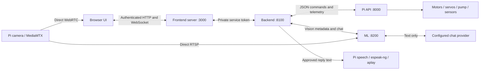

# Implemented system and audit map

> **Current startup update:** [READY_TO_RUN.md](READY_TO_RUN.md) records automatic installation/discovery, local sign-in, working keyless chat, and integrated partial-hardware support. It supersedes the older manual setup and readiness statements below. Start with the [root README](../README.md).

Updated 2026-09-09. This describes the current code. [Root setup](../README.md), [verification record](SYSTEM_VERIFICATION.md) and [hardware acceptance](PI_HARDWARE_ACCEPTANCE.md) are the operational references. The older architecture plans record earlier proposals.

> **Pi 2.3 update:** Normal partial-hardware startup, no Pi token or required `.env`, all eight sensor inputs read automatically, and per-pin diagnostic evidence. Backend/launcher Pi-token checks are removed. See [PI_PARTIAL_HARDWARE.md](PI_PARTIAL_HARDWARE.md). The backend still conservatively rejects nullable servo/pump state; partial-hardware UI handling remains a later integration task. Use Pi `/status` and its diagnostic now.

## Components and connections



The backend is the sole command authority. ML never connects to the Pi control API. The browser receives its controls and sensor state through the frontend proxy and backend. Camera video bypasses both servers: anyone with LAN access can open the Pi viewer, and ML reads the same source directly. No camera images are sent to the conversational API.

There are **three application servers on the computer**, plus the `run_stack.py` supervisor when used. The Pi has its Python server and MediaMTX, managed by `start_robo.sh`; native camera handling may add a helper process. Speech temporarily creates `espeak-ng` and `aplay` subprocesses on the Pi. ML owns two threads during vision: capture and inference. Other server work uses asynchronous tasks; libraries may create their own native threads. Optional offline chat adds its own model runtime process.

## What is implemented

| Area | Current behavior |
|---|---|
| Browser | Login, connection status, direct live video, detection overlay, sensors, ownership, manual controls, auto controls, model selection, chat, speaker option, Stop and Shutdown. |
| Backend | Sole owner, message validation and replay checks, stop/resume latch, sensor freshness/filtering, Pi/ML reconnects, bounded controls and chat gestures, stationary auto policy, speech forwarding. |
| Vision | One pretrained fire/smoke YOLOv8n model, direct RTSP capture, latest-frame processing, normalized boxes, session/model metadata and explicit errors. |
| Chat | Configurable OpenAI-compatible provider, bounded history/context, no tools or raw hardware instructions, deterministic small gestures. |
| Pi | Authenticated sole controller, raw sensor/status telemetry, drive/servo/pump/mode/system commands, command deadlines, explicit simulation, local speech. |
| Operations | Matching secret configuration, computer launcher, Bookworm Pi launcher, tests, component READMEs and this audit map. |

## Message map

All control messages are JSON objects in WebSocket text frames. Raw video is a separate media protocol. Optional example IDs must be unique per operation; the browser also sends increasing `seq` values. Ownership comes from the authenticated socket, not a claimed ID in the message.

### Browser through frontend to backend

The frontend serves `/login` and `/logout`, then proxies allowed `/api/v1/*` routes. The browser keeps a private session cookie; the frontend adds the backend service token on its upstream connection.

```json
{"type":"control","command":"claim","request_id":"ui-1","seq":1}
{"type":"control","command":"resume","request_id":"ui-2","seq":2}
{"type":"drive","direction":"forward","speed":0.2,"request_id":"ui-3","seq":3}
{"type":"servo","direction":"right","degrees":5,"request_id":"ui-4","seq":4}
{"type":"pump","on":true,"duration_ms":800,"request_id":"ui-5","seq":5}
{"type":"mode","value":"auto","request_id":"ui-6","seq":6}
{"type":"vision","command":"start","model_id":"fire-smoke-v8n","request_id":"ui-7","seq":7}
{"type":"chat","message":"look right","speak":false,"request_id":"ui-8","seq":8}
{"type":"speech","command":"stop","request_id":"ui-9","seq":9}
{"type":"system","command":"stop","request_id":"ui-10","seq":10}
{"type":"heartbeat","request_id":"ui-11","seq":11}
```

These are separate messages, not an array or a script to execute in sequence. Other choices include release, drive stop/backward/left/right, servo left/up/down, pump off, mode manual, vision stop and system shutdown. [Backend README](../Backend/README.md) contains the complete limits and response contract.

Backend responses include `hello`, `state`, `command_result`, `detections`, `chat.reply` and specific events. State contains ownership, stop reason, Pi/ML health, raw and processed sensors, commanded servo/pump state, active drive, auto phase and calibration gates. A successful command send is reported as sent; physical motion is not confirmed because the hardware has no position or motor feedback.

HTTP reads include `/api/v1/health`, `/api/v1/robot`, `/api/v1/video/sources`, `/api/v1/ml/models` and `/api/v1/auto/config`. Runtime auto configuration is read-only; calibration settings are server configuration.

### Backend to Pi

Connection: `ws://PI_IP:8000/ws`, without a token or Authorization header in Pi 2.3. One controller at a time; inspect `/status` alongside it without taking ownership.

| Message | Purpose |
|---|---|
| `{"type":"drive","left":1,"right":-1,"speed":0.2}` | Numeric signs control the two motor banks; speed is separate power within the same message. |
| `{"type":"servo","pan":-5,"tilt":0}` | Relative angle changes passed to the existing servo module. |
| `{"type":"pump","on":false}` | Boolean pump request. |
| `{"type":"mode","value":"manual"}` | Pi status label. Auto decisions stay in the backend. |
| `{"type":"system","command":"stop"}` | Stop motors/pump/speech and center at 90/90. |
| `{"type":"system","command":"shutdown"}` | Stop and exit Pi script, not the OS. |
| `{"type":"heartbeat"}` | Keep the control connection alive; does not renew a drive or pump burst. |

Pi sends `hello`, `heartbeat_ack`, periodic `status`, and `error`. Status includes `mode`, `speed`, `servos`, `pump`, raw `sensors`, `simulation`, `safety` and `speech`. Safety includes deadline state, faults and durable trip/expiry counters. No successful motion acknowledgement or measured position is invented.

For speech the backend uses token-free `POST /speech` with `{request_id,text}`, `GET /speech` for status and `DELETE /speech` to cancel. Submission requires an active Pi control lease. Text is capped at 500 characters. A 202 response means accepted for playback, not proof someone heard it.

### Backend to ML

The backend owns `/v1/inference` and sends session start/stop and heartbeat commands. ML replies with session lifecycle, health, errors and detection results. Results carry model/session/stream identity, frame sequence, decode-based age, source dimensions and normalized `[xmin,ymin,xmax,ymax]` boxes. The backend rejects stale or mismatched sessions. Camera/inference errors are distinct from a healthy frame containing no detections.

Chat uses `POST /v1/chat` with request/session identity, the user's message, bounded history and a small backend-generated robot context. The response contains text and at most one semantic action proposal. [ML audit guide](ML_IMPLEMENTATION.md) records the exact request/result examples and model replacement interface.

## Manual controls and failure handling

Startup and reconnection are stopped. An operator must claim and explicitly resume. Any viewer can stop; only the owner can resume/change controls. A second browser cannot silently take ownership. Mode changes and ownership loss invalidate pending gestures.

The UI sends held movement updates at 10 Hz. Backend drive input expires after 400 ms; Pi drive commands also expire after 400 ms independently. Backend heartbeats every 200 ms keep a Pi control lease of one second. Operator heartbeats expire after three seconds. Stale Pi telemetry, stale auto detections and reported Pi faults stop active operation. These are software deadlines, not a hardware power cutoff if the whole Pi or OS stalls.

Manual pump requests are limited to at most one second, with an 800 ms default. Repeated Pi on requests do not extend a burst. The backend also enforces cooldown. Stop cancels all outstanding movement and speech work. A delayed chat response cannot resume a stopped robot.

Sensors remain raw on the Pi. `Backend/sensors.py` records freshness and applies conservative clear-sample filtering. All four IR sensors must be fresh, correctly configured and clear before chassis movement. Binary IR/flame sensors do not provide a reliable distance estimate.

## Auto mode: current capability and limit

Auto is a deterministic policy in `Backend/auto_policy.py`; the chat model does not manage it. Calibration is required, with live fresh vision and sensors. The chassis remains stationary.

1. Search by small pan movements within the scan range.
2. Confirm a consistent fire detection across multiple frames. Smoke alone does not trigger water.
3. Aim in small relative steps toward the image center, within configured mechanical limits.
4. Require repeated alignment, spray for 800 ms, then wait five seconds before reassessment.
5. Stop after at most three bursts, a fault, an out-of-range target, or several clear frames after spraying. The operator must inspect and resume for another cycle.

The default confidence threshold is 0.65. None of these constants establishes real-world accuracy or a guaranteed extinguishing result. Camera/nozzle geometry and pump behavior must be checked. Automatic driving toward the target, distance estimation, obstacle navigation and impact prediction are not implemented because the necessary measurements/calibration have not been supplied.

## Models, chat and overlays

There is one fire/smoke model, plus one configured conversational model role. Model swapping stops the old inference session and waits for its workers before a new session. Current checkpoints must work with the registered Ultralytics adapter; another runtime needs an adapter. Training is a later offline workflow producing another registered checkpoint.

Supported gesture examples are `look left`, `look right`, `look up`, `look down`, `move a little forward`, `move backward`, `turn left`, `turn right` and `stop`. Look requests are five degrees; move requests are at most 300 ms at 20% power. The ML parser proposes them and the backend independently rechecks the original sentence, current owner, manual mode, stop state, sensors and one-second age budget. Ordinary chat cannot invent hardware commands.

Overlays are implemented now: the browser draws normalized fire/smoke boxes over its direct video, accounting for aspect ratio and expiring old results. They are approximate because the ML decoder's frame sequence is not the browser decoder's frame identity. Exact synchronized overlays, tracking and impact graphics need additional timestamp/geometry work later.

## Module and fault map

| File | Responsibility / first thing to inspect |
|---|---|
| `configure.py` | Matching service tokens and Pi addresses; conflict errors identify the setting. |
| `run_stack.py` | Child startup, environment and cleanup; service exit points to its log. |
| `Frontend/server.mjs` | UI login/session and authenticated HTTP/WS proxy. |
| `Frontend/public/app.js` | UI state, rendering, chat and operator actions. |
| `Frontend/public/control.js` | Held-input release and focus/visibility stopping. |
| `Frontend/public/video.js` | Direct WebRTC negotiation, reconnect and cleanup. |
| `Backend/app.py` | API/WS authentication, queues, startup/shutdown. |
| `Backend/controller.py` | Ownership, command validation, stop latch, timers, chat execution. |
| `Backend/pi_client.py`, `ml_client.py` | Connection and service transport failures. |
| `Backend/sensors.py` | Raw sensor validation, polarity and freshness/filter state. |
| `Backend/auto_policy.py` | Search/confirm/aim/spray/reassess decisions. |
| `ML/vision/` | Capture, model registry/adapter, inference workers and result validity. |
| `ML/chat/` | Provider configuration, conversational context and gesture proposals. |
| `PI/server.py`, `api/websocket.py` | Hardware coordinator, deadlines, command/status protocol. |
| `PI/audio.py` | Text-to-speech/playback queue, deduplication and cancellation. |
| `PI/hardware/` | Existing tested drivers; their hardware implementation was preserved. |
| `PI/start_robo.sh`, `mediamtx.yml` | Pi process startup and direct video. |

When reporting a failure, include the UI error/stop reason, relevant service log, model/session/request ID and whether simulation was enabled. Remove private tokens and provider keys. Use the [verification record](SYSTEM_VERIFICATION.md) to distinguish software checks from physical tests.
