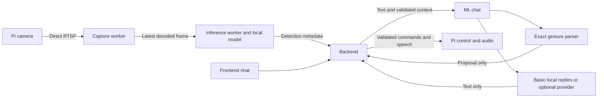

# ML service: operation and development

ML runs on the **computer**, alongside Backend and Frontend. It contains one local pretrained fire/smoke detector, basic chat that needs no key, an optional conversational API connection, and a deterministic gesture parser. It never connects to the Pi control socket or drives hardware. Backend owns robot decisions, ownership, stopping and speech delivery.

Use [Getting started](../Documents/GETTING_STARTED.md) for the complete project, [Operating guide](../Documents/OPERATING_GUIDE.md) for controls, [ML API](../Documents/API_ML.md) for exact messages, and the [documentation index](../Documents/README.md) for all current guides.

## Start and check ML

Double-click [START_ROBO.cmd](../START_ROBO.cmd) for normal Windows x64 operation. It prepares private runtimes and CPU dependencies, verifies/downloads the pinned model, generates matching service credentials, finds the Pi and starts all three computer servers. Python, Node and an LLM key do not require manual configuration first. First installation needs internet; local inference/basic chat do not need a cloud API afterward.

To prepare without starting servers, run from the repository root:

```powershell
.\START_ROBO.cmd -Check
```

The launcher chooses available ports; **8200 is ML's default, not a guarantee for every run**. Backend's ML URL is set automatically. Read `logs/ml.log` for the listening port and errors. A stopped vision engine normally reports `ready: false`, `healthy: true`.

For standalone ML development, stop the full stack, run `-Check`, then:

```powershell
.venv\Scripts\python.exe -m ML
```

Standalone startup reads `ML/.env`. It does not perform automatic Pi discovery, port selection or root `.env` key loading. Its configured stream must be reachable. Capture starts only after authenticated `session.start`; starting the service does not start auto mode. Use one process and one Uvicorn worker, without reload. See [Development](../Documents/DEVELOPMENT.md) for other development environments; the Pi has its own server/installer.

## Keyless chat and the optional API key

Leave the automatically created root `.env` blank for now:

```dotenv
CHAT_API_KEY=
```

Basic local chat handles greetings, thanks, identity, help, a simple robot joke, status, detector summaries and speaker availability. Try `hello`, `status`, `what do you see?`, `help`, or `can you speak?`. It uses ordinary English phrase/keyword rules, not an offline LLM. Open-ended questions receive a limited-capability explanation rather than invented answers.

Only validated Backend context supports status claims. State older than 1,000 ms and detections older than 750 ms are stale. Conversation history cannot create observations. Missing detection is not proof of a safe scene. Speaker availability is a Backend report, never proof that audio played.

For broader conversation later, add a key to the root `.env` and restart the complete stack. Defaults are `https://api.openai.com/v1` and `gpt-4.1-mini`; no other setting is needed for this default provider. Provider/account access and quota still determine whether requests succeed. Provider failures return useful local text and a redacted error code, without stopping vision or granting actuator access.

The launcher gives the key only to ML. A nonempty root key overrides the ML file's key unless the process environment already defines `CHAT_API_KEY`. A blank root key preserves an advanced ML key. Standalone `python -m ML` reads process variables and `ML/.env`, not the root key file. Never put secrets in browser code, registry entries or chat requests.

### Advanced compatible provider or offline LLM

To replace the default provider, change `ML/.env`:

```dotenv
CHAT_BASE_URL=https://your-compatible-provider.example/v1
CHAT_MODEL=the-exact-model-name
CHAT_API_KEY=
CHAT_TOKEN_LIMIT_FIELD=max_tokens
```

The adapter appends `/chat/completions`. Remote endpoints require HTTPS. HTTP is allowed only on `localhost`, `127.0.0.1` or `::1`. URL credentials/query/fragment are rejected; redirects and ambient HTTP proxies are not used. A custom endpoint needs an explicit model. Blank legacy model configuration is filled automatically only at the default OpenAI base.

A separately installed local compatible runtime can use:

```dotenv
CHAT_BASE_URL=http://127.0.0.1:11434/v1
CHAT_MODEL=the-exact-locally-installed-model
CHAT_API_KEY=
CHAT_TOKEN_LIMIT_FIELD=max_tokens
```

Loopback endpoints may omit the key; configure a placeholder only if that runtime requires one. Clear a populated root key when switching to keyless local inference, because root-key precedence still applies. No offline conversational model/runtime is bundled or automatically installed. This optional replacement adds its own process and memory needs; built-in basic chat needs neither.

The adapter sends non-streaming Chat Completions with a 384-token budget, no tools and one expected completed assistant text response. The token field is exactly `max_tokens` or `max_completion_tokens`. Compatibility requires testing with the chosen provider. See the [provider wire contract](../Documents/API_ML.md#optional-provider-wire-contract).

## Gestures and auto mode

The exact phrase parser runs before any provider call. It recognizes one request, with normalized case/whitespace and optional polite wording:

| Phrase | Proposal to Backend |
|---|---|
| `look left`, `look right`, `look up`, `look down` | One relative 5-degree face movement. |
| `move forward`, `move backward`, `move backwards`, `move a little bit forward` | 300 ms movement at speed fraction 0.2. |
| `turn left`, `turn right` | 300 ms turn at speed fraction 0.2. |
| `stop` | Stop proposal. |

`please look right` and `can you move forward?` work. Quoted, negated, embedded and multi-step phrases do not match: `don't move forward`, `say stop`, and `look right and move forward` produce no action. `move left` is ambiguous. Chat cannot request pump activation, arbitrary distances/angles/speeds, mode changes, shutdown or scripts.

Non-stop proposals require connected, fresh, resumed manual state, matching ownership and a ready Backend executor. Stop skips freshness/manual/resume gates but still requires connected matching ownership/executor in ML's API. Backend also has a direct stop path; see [Backend/Frontend API](../Documents/API_BACKEND_FRONTEND.md). Backend independently revalidates proposals and their one-second total age budget. Model prose or JSON is never converted into commands.

**The LLM is not the auto-mode manager.** Vision supplies observations; Backend's deterministic policy scans, confirms, aims and sprays briefly while stationary. ML does not navigate toward fire, estimate approach distance, fuse sensors or activate the pump. See [Architecture](../Documents/ARCHITECTURE.md) and [Hardware](../Documents/HARDWARE.md).

## Runtime flow and processes



One ML application process has one asyncio event loop for HTTP/provider/WebSocket tasks. An active vision session adds two application threads: capture and inference, not one set per viewer. OpenCV/PyTorch may add native threads. ML creates no training, speech or offline LLM process.

`session.start` creates a new generation/capture identity. Capture opens RTSP while inference verifies/loads weights. One waiting frame is retained; new frames replace older waiting frames during loading or slower inference. The first real frame is warmed and predicted before `session.ready`; a loaded model or open socket alone is insufficient.

The adapter produces normalized original-image boxes. The engine validates outputs and retains one latest unsent result. `frames_dropped` counts replaced waiting frames, not lost network packets or overwritten results. Frame age measures waiting/inference since **local decoder receipt**, not camera exposure. Browser video has an independent reader and no shared frame clock, so overlays are approximate.

Stop/disconnect immediately invalidates the generation, clears queued data and requests worker exit. New sessions cannot overlap old workers. Native library calls cannot safely be killed as Python threads; a persistently unhealthy worker needs an ML process restart. Backend treats missing/stale results as unavailable for auto actions.

| Internal limit | Current value |
|---|---|
| OpenCV RTSP open/read timeout request | 5,000 / 2,000 ms; native backend behavior still matters. |
| Fresh-frame monitoring | 5 seconds without decoded frames makes vision unavailable. |
| Model-load budget | 60 seconds; a native load can outlive cancellation. |
| Inference freshness budget | 15 seconds; separate from Backend's tighter acceptance limit. |
| Worker-stop health deadline | 3 seconds. |
| Queues | One waiting frame, one unsent result, 16 lifecycle events, 32 pending WS command replies. |
| Detection count | Engine allows 1,000; current Backend accepts **at most 100/result**. |

## Module responsibilities

Paths below are relative to `ML/`.

| Module | Responsibility / debugging boundary |
|---|---|
| `__main__.py` | Loads ML settings without overriding process variables; starts one Uvicorn worker. |
| `config.py` | Environment values, numeric limits and default conversational model. |
| `schemas.py` | Strict public JSON fields, types, identifiers and limits. |
| `app.py` | HTTP/WS authorization, single inference owner, routing, body bounds and replay cache; injectable engine/chat/registry for tests. |
| `vision/capture.py` | One RTSP/OpenCV/FFmpeg reader; default TCP transport; open/read/release. |
| `vision/registry.py` | Artifact metadata, class maps and SHA256 checks. Availability only means a file exists. |
| `vision/adapter.py` | Ultralytics `.pt` load/warm/predict/close and original-frame box normalization. |
| `vision/engine.py` | Generations, workers, latest-data slots, lifecycle and health; injectable factories. |
| `chat/actions.py` | Full-match grammar, fixed bounds, advisory gates and proposal IDs. |
| `chat/local_basic.py` | Keyless text from current context; no actions or history-derived state. |
| `chat/service.py` | Chat validation/routing, robot context, personality and provider fallback. |
| `chat/provider.py` | Compatible HTTP; endpoint/time/size/token limits; no retries/tools; redacted errors. |
| `download_model.py` | Pinned installation, hashes, atomic artifacts/provenance, no overwrites and OS-owned lock. |
| `check_model.py` | Blank-frame/image runtime check; constructs Ultralytics directly. No hardware/chat calls. |
| `models/registry.json` | Registered artifacts, loaded at process start; no live reload endpoint. |
| `tests/` | API, chat, provider, gesture, vision and download fixtures. |

Root `bootstrap.py` invokes model installation/verification during setup. Serving requests never installs packages or downloads weights. The launcher stores caches in `.runtime/` and forces `YOLO_OFFLINE=true`, `YOLO_AUTOINSTALL=false`.

## Full ML configuration reference

These are code defaults. The complete launcher can override ports, stream URL and generated secrets. Changes require restart. See [Configuration](../Documents/CONFIGURATION.md) for cross-service precedence.

| Variable | Default | Meaning / accepted values |
|---|---|---|
| `ML_HOST` | `127.0.0.1` | Listening interface; normal launcher uses loopback. |
| `ML_PORT` | `8200` | Integer 1–65535; launcher chooses a free port. |
| `ML_SERVICE_TOKEN` | Empty in code | Backend Bearer secret, generated/matched automatically. Empty denies protected operations. |
| `ML_STREAM_URL` | `rtsp://robo.local:8554/cam` | RTSP/RTSPS host and valid port; normally discovered. No request-level override. |
| `ML_STREAM_ID` | `pi-cam` | Nonempty identity; must match Backend. |
| `ML_MODEL_REGISTRY` | `models/registry.json` | Relative to `ML/`, or absolute; artifact paths are relative to the registry. |
| `ML_DEVICE` | `cpu` | Runtime device; choosing a GPU string does not install GPU support. |
| `ML_CONFIDENCE` | `0.35` | Finite detector threshold 0.01–1, separate from Backend auto threshold. |
| `ML_MAX_FPS` | `10` | Finite prediction rate cap 0.1–120; not guaranteed throughput. |
| `ML_BACKEND_TIMEOUT_SECONDS` | `10` | 1–60 seconds without incoming WS traffic before close. |
| `ROBOT_NAME` | `Robo` | 1–40 ASCII letters/digits/spaces/underscore/hyphen. |
| `CHAT_BASE_URL` | `https://api.openai.com/v1` | Compatible base endpoint; restrictions above. |
| `CHAT_MODEL` | `gpt-4.1-mini` | At most 128 characters, no control characters; custom endpoint needs explicit model. |
| `CHAT_API_KEY` | Empty | Optional provider secret; root-key loading belongs to the full launcher. |
| `CHAT_TIMEOUT_SECONDS` | `20` | Provider deadline, 1–60 seconds. Backend's chat HTTP client has its own 20-second timeout. |
| `CHAT_TOKEN_LIMIT_FIELD` | `max_tokens` | Exactly `max_tokens` or `max_completion_tokens`; budget stays 384. |
| `OPENCV_FFMPEG_CAPTURE_OPTIONS` | `rtsp_transport;tcp` when unset | Advanced process-wide FFmpeg options; explicit existing value takes precedence. |

The launcher sets `YOLO_CONFIG_DIR`, `MPLCONFIGDIR` and `TORCH_HOME` under `.runtime/`. ML's `requirements.txt` contains API dependencies, `requirements-vision.txt` adds vision dependencies, and `requirements-vision-tested.txt` records an observed environment rather than a universal GPU/OS lockfile.

## Pretrained artifact: identity versus accuracy

| Property | Current default |
|---|---|
| Registry ID / runtime | `fire-smoke-v8n` / Ultralytics `.pt` detection |
| Publisher | `rabahdev/fire-smoke-yolov8n` |
| Revision | `13017fe8af477c25f5298d168e2dfede4b000753` |
| Original / installed file | `best.pt` / `ML/models/weights/fire-smoke-v8n.pt` |
| Expected size | 6,229,802 bytes |
| SHA256 | `b91633799ceb052c814b4f8b77a37efc9a40f002d528df97d74463585fa4f28f` |
| Classes | `fire`, `smoke`, mapped by actual label names. |
| Recorded source/license | [Pinned publisher artifact](https://huggingface.co/rabahdev/fire-smoke-yolov8n/blob/13017fe8af477c25f5298d168e2dfede4b000753/best.pt); publisher metadata `AGPL-3.0`. |

No training was performed in this delivery. Fire and smoke share one model. A newer YOLO family is not automatically compatible or better for this robot: the current adapter needs a loadable native detection `.pt` artifact with an actual mapped fire label. Relabeling generic object weights does not train a fire detector.

Hash checks establish artifact identity. Blank-frame inference establishes loading/output compatibility. Neither establishes detection accuracy, real camera latency or nozzle behavior. Real CPU inference was tested on synthetic input; physical acceptance remains separate. See [Testing and troubleshooting](../Documents/TESTING_AND_TROUBLESHOOTING.md).

## Recipe: swap compatible weights

1. Obtain a trusted compatible fire-detection `.pt` artifact and its provenance/license. Keep the original trainable checkpoint. Do not overwrite the installed default.
2. Save it under `ML/models/weights/`, for example `fire-lab-v1.pt`, and compute its hash:

   ```powershell
   (Get-FileHash ML/models/weights/fire-lab-v1.pt -Algorithm SHA256).Hash.ToLower()
   ```

3. Add an object to the registry's `models` array. Keep the default entry unchanged: setup checks its pinned metadata and rejects conflicting replacements. This template requires actual hash/revision/source/license/labels:

   ```json
   {
     "id": "fire-lab-v1",
     "revision": "your-immutable-checkpoint-revision",
     "adapter": "ultralytics",
     "artifact": "weights/fire-lab-v1.pt",
     "sha256": "REPLACE_WITH_THE_EXACT_64_HEXADECIMAL_DIGIT_SHA256",
     "class_map": {"flame": "fire", "smoke": "smoke"},
     "source": "your-artifact-provenance",
     "license": "your-artifact-license"
   }
   ```

   Mapping keys must match actual labels after trim/lowercase; values are only `fire`/`smoke`. A fire mapping and matching real label are required. Unmapped labels are excluded. Use distinct IDs starting with a letter/digit, containing letters/digits/`.`/`_`/`-`, at most 96 characters for API compatibility. Registry parsing itself allows 128; the API does not.

4. Check locally:

   ```powershell
   .venv\Scripts\python.exe -m ML.check_model --model fire-lab-v1
   .venv\Scripts\python.exe -m ML.check_model --model fire-lab-v1 --image path/to/representative-image.jpg
   ```

5. Restart ML/the stack to reload the registry. Select the new model in the UI. Protocol sequence: stop the old session, wait for workers to stop, start a new session ID/model ID. `model.select` validates registration only; it does not load or switch an active session. Backend's preferred initial model is `ROBO_MODEL_ID`; see [Configuration](../Documents/CONFIGURATION.md).
6. Evaluate labeled footage for false positives/missed fire, low light, blur and sustained latency. Keep held-out data and record artifact revisions. One successful image is not acceptance. Revert by selecting the preserved previous model.

## Recipe: another model family, training or export runtime

An incompatible family or ONNX/TensorRT export needs code beyond a registry entry. These are extension steps, not implemented runtime support:

1. Implement an adapter constructed with `(ModelSpec, device, confidence)` and `load()`, `warm(frame)`, `predict(frame)`, `close()`. Input is OpenCV BGR image data. Output is a list of objects such as `{"class":"fire","score":0.8,"bbox":[0.1,0.2,0.4,0.6],"track_id":null}`, using finite normalized original-image coordinates and positive box area.
2. Add explicit factory dispatch on `spec.adapter`, failing unsupported names. Pass it through `VisionEngine(adapter_factory=...)` in app construction. The default is a fixed Ultralytics factory, not a dynamic plugin loader. Update `check_model.py`, which currently creates Ultralytics directly.
3. Preserve hashes, generation invalidation, bounded queues, readiness, errors and cleanup. Undo resize/letterbox transforms before returning boxes. Meet Backend's 100-box limit.
4. Test load failures, labels, invalid/non-finite coordinates, stale frames, stop during loading/prediction and resource release. Tracking/sensor fusion requires coordinated capability/schema/Backend changes; current metadata advertises neither.

Future training should run offline: version datasets/splits, base weights and configuration; train; evaluate on separate held-out robot-like footage; register accepted output under a new ID/revision/hash. No robot API starts training. Keep original trainable checkpoints alongside exports. Exported inference formats need their own adapter, parity checks and target-device benchmarks; optimizer state for resuming somebody else's training is not guaranteed.

## Recipe: replace the whole ML server

The boundary is [API_ML.md](../Documents/API_ML.md), consumed by `Backend/ml_client.py` and `Backend/controller.py`. Another language/runtime can implement it while preserving endpoints, auth, fields, session/heartbeat/freshness behavior and proposal-only control. Keep direct camera access separate from Pi actuation.

For an in-process replacement, `create_app` accepts injected engine/chat/registry objects; API test doubles show their methods. For a separately launched replacement, Backend's ML URL can point to it. The standard launcher starts `python -m ML` and chooses a local URL automatically; changing only a Backend file's URL does not replace that launch command. Standard-launch integration also needs a service-command/environment change.

Adapt `ML/tests/test_api.py` fixtures or turn its requests into network contract tests. Run Backend event-validation tests and the integration harness with the replacement command. The harness currently starts `python -m ML`; an external replacement needs a test-only command substitution. Required checks include:

- Missing/wrong auth and browser Origin rejection; one inference owner.
- Fresh session IDs, stop-before-restart, actual stopped-worker health, no old-generation results.
- Strict types/limits, bounded frames/results, stable stream/capture identity and increasing sequence.
- Useful keyless chat, session-scoped replay suppression, bounded proposal TTL, no provider-text execution.
- Camera/model failures as errors, never fabricated healthy empty detections.
- Stop/disconnect invalidation during load/predict and no hidden hardware connection.

## Tests and fault isolation

From the repository root:

```powershell
.venv\Scripts\python.exe -m unittest discover -s ML/tests -t . -v
.venv\Scripts\python.exe -m ML.check_model
```

The ML suite has 78 tests at this update. It covers API/session/replay, chat/provider gates, worker isolation and atomic downloads/OS locks. It requires neither a key nor physical robot access and does not measure real-fire accuracy. Broader results belong in [Testing and troubleshooting](../Documents/TESTING_AND_TROUBLESHOOTING.md).

Start at `/health`, authenticated `/models`, then `logs/ml.log`. A running HTTP server is not a ready detector; `artifact_available` is not hash/load verification; `chat.configured` is not provider access; speaker availability is not audible playback. Report error code, session/model/stream IDs and ages without secrets. The sibling `.verification` directory is developer tooling, not a runtime dependency.
